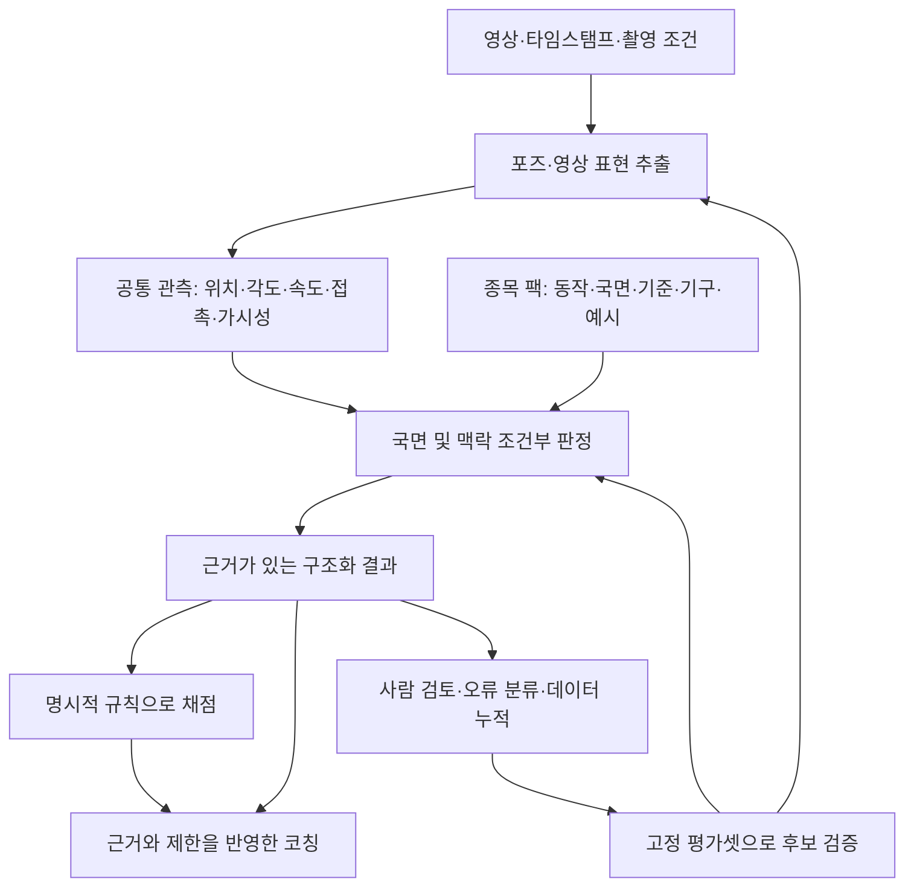

# Sunity의 지속 학습·다종목 확장 전략에 대한 외부 검토

작성: 2026-09-23 · 검토자: Codex · 상태: **설계 권고안 — 기존 정책을 변경하거나 학습을 실행한 문서가 아님**

검토 대상: [외부 리뷰 브리프](/Users/kimtaesung/Dev/SunityMotion/.planning/phases/37-continuous-learning/37-EXTERNAL-REVIEW-BRIEF.md), 관련 기획 문서, 현재 저장소의 데이터·학습·측정·채점 코드, 원 논문과 공식 문서.

## 1. 결론

**데이터 누적형 B를 기본으로 삼는 선택은 맞다. 그러나 현재의 ‘Gemini 답변을 누적해 8B VLM에 여러 작업을 한꺼번에 가르치는 방식’을 반복하는 것만으로 모든 종목에서 똑똑해지는 모델이 만들어지지는 않는다.**

Sunity가 장기적으로 소유해야 할 것은 검증된 동작 데이터, 관측·판정의 공통 구조, 종목별 기준, 독립 평가셋, 그리고 그것을 통해 성능이 입증된 모델이다. 가중치도 자산이지만, 잘못된 데이터를 다시 판단하고 새 모델에 옮길 수 있는 근거가 더 오래간다.

현재 우선순위는 다음과 같다.

1. **측정·평가하지 못한 동작을 100점과 확신에 찬 칭찬으로 표시하는 문제를 해결한다.**
2. kip-up의 관측 가능한 결함과 시간 구간을 확정하고, 특징·정렬·기준·문구 중 어느 단계가 실패하는지 분리한다.
3. 여러 사람의 실제 수행과 강사 관측으로, 모델과 규칙을 함께 평가할 독립 기준을 만든다.
4. 프롬프트·검색·결정적 측정으로 해결되지 않는 작업 하나를 대상으로 파인튜닝 효과를 검증한다.
5. 그 작업이 새 사람·새 촬영 조건에서 개선되는 것을 확인한 뒤, 두 번째 종목에서 전이 효과를 검증한다.

파인튜닝은 장기 전략에 포함해야 한다. 다만 지금은 **큰 통합 모델을 반복 학습할 시점보다, 무엇을 학습하면 서비스가 실제로 좋아지는지 입증할 시점**이다. 이것은 자체 모델을 포기하자는 제안이 아니라, 자체 모델이 배울 과제와 정답을 먼저 제대로 만드는 제안이다.

## 2. 서비스를 어떻게 이해했는가

Sunity의 제품은 영상 설명기가 아니라 **수강생이 다음 연습에서 무엇을 바꿀지 결정하도록 돕는 동작 비교 코치**다. Mode 1은 전문가 기준과의 비교, Mode 3은 본인의 과거 수행과의 비교다. 따라서 좋은 모델의 기준은 그럴듯한 코칭 문장이나 낮은 학습 손실이 아니다.

- 실제 차이가 있는 부위와 순간을 찾는다.
- 촬영·가림·체형 차이를 수행 결함으로 오인하지 않는다.
- 관측 사실, 기준 위반, 원인 가설을 구분한다.
- 측정 근거와 점수 산식을 추적할 수 있다.
- 다음 수행에서 확인할 수 있는 교정 과제를 제시한다.

Mode 3에서 ‘지난번보다 좋아짐’과 Mode 1의 ‘기준을 충족함’은 별개다. 큰 개선이 있어도 기준에 미달할 수 있고, 동일한 품질이라도 촬영 방향 때문에 수치가 달라질 수 있다. 두 모드를 같은 점수 해석으로 묶으면 학습 모델이 좋아져도 제품 판단은 틀릴 수 있다.

## 3. 브리프와 현재 저장소를 대조한 결과

이 검토에서는 GPU 분석이나 재학습을 새로 실행하지 않았다. 아래에서 **코드 확인**, **기존 실측 보고**, **검토자의 추론·제안**을 구분한다. 2026-09-22 결과는 기존 보고를 사용했으며, 영상 원본을 직접 판독해 재검증한 결과가 아니다.

| 항목 | 확인된 내용 | 판단에 미치는 영향 |
|---|---|---|
| 수집 규모 | manifest 548행. YouTube 414, Instagram 92, internal 17, pilot 계열 25 | 행 수는 확인되지만, 독립 수행자 수·사용 가능한 권리·정답 품질을 뜻하지 않는다 |
| 승격 | promotion ledger 5회 모두 `promoted=false`, `current=null` | 현재 방식이 제품 개선으로 이어졌다는 증거가 없다 |
| 244행의 의미 | v38 기록은 distill 210 + text 34, perturb 0. `train_rows/val_rows`는 null | 244편의 독립 영상이나 244개 검증 정답으로 해석하면 안 된다 |
| 직전 성적 | `TRAINING-DUE.md`의 ‘빈 골격 9/29’는 **v29**라고 명시됨 | v38의 최신 성적으로 확정해 인용하면 안 된다. 사이클별 평가 원본 연결 필요 |
| 동일 실험 | 브리프는 v35·v36 데이터 동일이라고 보고. 원장의 구성 수는 동일 | 실행 순서·seed·하이퍼파라미터까지 같았는지는 별도 확인 필요. 동일 데이터 재실험 자체는 잘못이 아니다 |
| 사람 판정 | 현재 `judgments.jsonl`에 오너의 kip-up 관측 2건, pairs 6건, subjects 1건 존재 | ‘사람 라벨 0건’은 현재 전체 저장소에는 더 이상 정확하지 않다. 다만 독립 강사 검증과 학습 투입은 확인되지 않았다 |
| 특징 | 기본 관절각 8개 외에 각도 차분·2차 차분, split, 머리–척추 정렬, 몸통 수직도 함수가 존재 | ‘특징이 오직 각도 8개’는 과도한 요약. 필요한 특징의 **측정·배선·평가 적용 여부**가 핵심 |
| kip-up 기준 | YAML은 비어 있지만, 주석에 잘못된 무릎 신전 기준을 의도적으로 제거한 이유가 적혀 있음 | 빈 YAML을 임의 각도로 채우는 처방은 과거 오류를 재도입할 수 있다 |
| kip-up 원인 | 기존 보고는 seed 편차와 신뢰구간 억제의 직접 계측을 미확인으로 남김 | ‘criteria 부재 하나가 확정 원인’이라는 결론은 아직 이르다 |
| 점수 출처 | 코드가 slope 1.2를 `[ASSUMED]`로 구분. 실행 상한 40은 자체 환산, 최저점 25도 제품 정책 | 현재 점수 전체가 IPSF 원문에서 직접 나온 것은 아니다 |

또한 2D RTMW 결과의 z를 0으로 채우는 코드 경로가 있다. `Keypoint3D`라는 이름이나 배열의 3채널만으로 실제 3D를 측정했다고 볼 수 없다. 이번 실측에 사용된 깊이 경로는 런 메타데이터로 확인해야 한다. 기존 `features.py`의 NLF·3D 설명도 현행 모든 경로의 보증으로 읽어서는 안 된다.

이 차이들은 장기 방향을 뒤집지는 않지만, **무엇이 없어서 실패했는지 잘못 규정하면 다음 학습도 잘못 설계된다**는 점에서 중요하다.

## 4. A와 B: B를 유지하되, 선택 이유를 정확히 고친다

### 4.1 B는 현재 규모의 좋은 기본값이다

여기서 B의 ‘처음부터’는 파운데이션 모델을 무작위 초기화해 사전학습한다는 뜻이 아니다. **같은 사전학습 베이스를 불러와 새 어댑터를 초기화하고, 선별된 누적 데이터로 다시 미세조정한다**는 뜻이다.

소량 데이터, 불확실한 라벨, 작은 팀에서는 이 방식이 비교 실험과 잘못된 라벨 제거에 유리하다. 모델 교체 때도 원영상·관측·근거를 보존했다면 새 입력 형식으로 다시 구성할 수 있다.

다만 ‘지금까지 들어온 모든 데이터를 무조건 재학습’해서는 안 된다. 원천 기록은 이력을 남기고, 학습 스냅샷은 중복 제거·라벨 수정·동의 상태·종목별 균형을 반영해 만든다. **누적 저장소와 이번 학습에 쓰는 데이터셋은 다르다.**

### 4.2 브리프의 A 비판 중 과한 부분

| 기존 주장 | 수정된 판단 |
|---|---|
| A는 반드시 망각한다 | 새 데이터만 학습하면 위험하지만, 과거 데이터 replay 등으로 완화할 수 있다 |
| A는 되돌릴 수 없다 | 이전 모델·옵티마이저·데이터 버전을 보관하면 롤백 가능하다 |
| A는 재현 불가능하다 | 실행 계보를 보존하면 가능하다. B보다 관리할 상태가 많다는 차이다 |
| A는 베이스를 교체할 수 없다 | 주기적으로 새 베이스에 재학습하는 혼합 전략이 가능하다 |
| B는 망각을 피한다 | 과거 도메인 데이터를 재사용하는 데 유리하지만, 베이스의 일반 능력이나 소수 종목의 성능 보존을 보장하지 않는다 |
| B는 베이스+데이터+하이퍼파라미터로 충분히 재현된다 | 전처리·영상 디코딩·샘플링·토크나이저·라이브러리·seed·평가 코드도 고정해야 한다. 비트 단위 동일성은 별도 문제다 |

이전 예제를 재사용하는 단순 replay가 망각 완화에 효과적일 수 있다는 실험 근거가 있다. 그렇다고 그 결과가 Sunity VLM의 효과를 보증하지는 않는다. **A를 불가능한 방식으로 규정할 이유는 없지만, 지금 A의 운영 복잡성을 감수할 이유도 약하다.** [On Tiny Episodic Memories in Continual Learning](https://arxiv.org/abs/1902.10486)

장기적으로 데이터·학습 시간이 커지면 ‘주기적 B + 중간에 replay를 포함한 제한적 A’를 비교하면 된다. 전환 기준은 영상 개수가 아니라 **승인된 시간·비용 내에 B가 끝나는지, A가 동일 평가셋에서 이득을 내는지**다.

## 5. 현재 병목은 무엇인가

### 5.1 가장 먼저 고칠 것은 검사 범위와 결론의 불일치다

`감점 records=[]`는 다음 세 가지를 모두 포함할 수 있다.

- 필요한 검사를 수행했고 위반이 없었다.
- 중요한 특징이나 기준이 없어 검사하지 못했다.
- 영상 품질·가림·정렬 실패로 판정할 수 없었다.

이 세 경우가 모두 ‘100점, 지금 자세를 유지하세요’로 이어지면 모델 성능과 무관하게 신뢰가 무너진다. **정상, 미검사, 판정불가를 별도 상태로 표현**해야 한다. 정량 평가를 충분히 수행하지 못했다면 점수 보류 또는 평가 범위가 명확한 부분 결과를 검토한다. 이는 제품 변경 제안이며, 이 문서에서 기존 점수 정책을 바꾸지는 않는다.

검사 범위의 분모는 모델이 발견한 결함 수가 아니라, 해당 동작에서 **원래 검사해야 하는 항목 목록**이어야 한다. 아무것도 발견하지 못했다고 검사 범위 100%가 되면 안 된다.

### 5.2 kip-up은 단계별로 원인을 분리한다

왼어깨 중앙값이 31.8° 다르다는 관측은 유용하다. 그러나 전체 영상 중앙값의 차이는 **동일 국면에서 기준을 위반한 편차**와 같지 않다. 수행 속도, 국면 길이, 촬영 방향, 가림의 영향일 수도 있다. 확대 카드의 어깨 앵커도 채점 가능한 관측이 전달되었다는 증거까지는 아니다.

권장 실험은 같은 입력으로 아래를 기록하는 것이다.

| 단계 | 확인할 질문 | 다음 조치 |
|---|---|---|
| 영상·좌표 | 다리 상승과 팔 변화가 실제 보이는가? 좌표가 그 변화를 담는가? | 실패하면 포즈·촬영 품질 문제부터 해결 |
| 시간 구간 | 추진·상승·최고점 중 어느 구간의 차이인가? 비교 시점이 같은가? | 사람이 확인한 이벤트 구간을 넣어 정렬 단계와 분리 |
| 특징 | 다리 높이, 골반 상승, 팔 각도 변화가 정상적으로 계산되는가? | 필요한 표현 추가 또는 연결 |
| 기준 | 그 차이는 기술적으로 잘못인가, 허용 가능한 변형인가? | 근거 있는 판정 규격 작성. 단순 ‘챔피언과 다름’은 결함으로 확정하지 않음 |
| 감점·출력 | criterion이 활성화되는가? 어디서 억제되는가? 미검사를 칭찬하는가? | seed·threshold·가시성·coverage·문구의 원인을 개별 수정 |

기준 구간과 관측을 정확히 넣었을 때 기존 코드가 올바른 결과를 낸다면, 학습 후보는 **구간 찾기나 관측 추출**이다. 그래도 실패하면 규칙·배선 문제다. 이 실험으로 모델과 비모델 개선의 가치를 구분한다.

20°를 낮춰 이 한 쌍을 분리시키는 것은 권하지 않는다. 특히 팔꿈치·어깨·다리 높이에 같은 기준을 적용할 근거부터 검토해야 한다.

### 5.3 비용을 들이기 전 제거할 학습 실패 요인

현재 학습은 좌표 보정, 결함, 시간 구간, 렌더 명세, 코칭을 한 출력에 담는다. `run_sft.sh`에는 긴 텍스트 타깃과 메모리 문제를 기록한 주석이 있고, 기본 최대 길이는 32,768, LoRA rank는 64, `freeze_vit=false`다. 이것만으로 실패 원인을 확정할 수는 없지만, 적은 정답으로 너무 많은 출력을 학습하고 있는지 먼저 점검할 이유가 충분하다.

다음 전체 사이클 전에 작은 샘플로 확인한다.

- 프레임·타임스탬프·좌표·정답이 실제로 대응하는가?
- assistant 정답 토큰에 손실이 걸리고, 중요한 정답이 잘리지 않는가?
- 빈 배열·복사 좌표를 출력하는 것만으로 손실을 낮출 수 있는가?
- 소수의 명확한 학습 예제를 재현할 수 있는가? 이 검사는 파이프라인 건전성 검사이며 일반화 성적이 아니다.
- 추론 시 프롬프트·프레임 샘플링·스키마가 학습과 같은가?

QLoRA는 메모리를 절약하는 방법이지 적은 데이터의 정보량을 늘리는 방법이 아니다. 멀티모달 입력과 긴 출력에서는 가중치 외의 메모리 비용도 크다. 따라서 ‘8B는 항상 A100이 필요하다’도, ‘4-bit이므로 소비자 GPU면 충분하다’도 일반화할 수 없다. [QLoRA 원 논문](https://arxiv.org/abs/2305.14314)

공식 Qwen 학습 코드는 시각부·언어부 등의 학습 범위를 제어한다. 첫 재실험은 출력과 학습 모듈을 좁혀 비교할 가치가 있다. 단, 시각부 고정이나 특정 rank가 Sunity에 최적이라는 뜻은 아니다. 실제 학습 가능한 파라미터 목록과 메모리를 확인해야 한다. [Qwen3-VL 공식 미세조정 안내](https://github.com/QwenLM/Qwen3-VL/blob/main/qwen-vl-finetune/README.md)

## 6. 여러 종목으로 확장할 아키텍처

### 6.1 공통인 것은 신체 관측이고, 결함은 맥락에 따라 결정된다

‘무릎이 굽었다’는 관측이다. ‘무릎을 굽히면 안 된다’는 종목·동작·국면·목표의 판단이다. 어깨 위치나 팔 굽힘도 동일하다. 따라서 ‘견갑 하강 실패’ 같은 표현 자체를 모든 종목의 보편적 결함으로 학습시키면 오히려 잘못된 전이가 생긴다.

**1층과 2층을 나누는 것만으로 종목 전이가 완성되지는 않는다.** 관측 가능성, 기구 접촉, 기준의 의미, 새로운 종목의 평가 데이터도 필요하다. 여러 층을 반드시 별도 모델이나 서버로 구현할 필요도 없다. 먼저 데이터와 함수의 입출력 계약을 나누고, 별도 가중치는 성능 이득이 있을 때 도입한다.



### 6.2 각 부분의 소유 범위

| 부분 | 입력 → 출력 | 초기 구현 | 학습 도입 조건 |
|---|---|---|---|
| 지각 | 프레임 → 좌표·가시성·영상 특징 | 기존 RTMW/VLM 재사용 | 가림·역전 자세의 지각 오류가 측정되고 보정 정답이 확보됨 |
| 공통 관측 | 좌표·시간·촬영 정보 → 신체·기구 관계의 관측 | 검증 가능한 기하 계산 중심 | 간단한 계산으로 어려운 접촉·이벤트 등에 충분한 라벨 확보 |
| 국면·판정 | 관측·영상 구간·종목 팩 → 부위·시점·상태·근거 | 규칙 + 프롬프트 + 검토된 예시 검색 | 가장 유력한 첫 파인튜닝 후보. 독립 평가에서 이득 확인 |
| 채점 | 검증된 관측·criterion → 감점 내역 | 현재 투명한 규칙 엔진 유지 | 사람 총점 모방 학습은 도입하지 않음 |
| 코칭 | 확인된 사실·판정·허용된 지침 → 설명·연습 과제 | 템플릿 또는 기존 언어 모델 | 사실 보존·한국어 품질·비용 측면에서 별도 평가 후 전환 |

종목 팩에는 동작 별칭, 국면 전이, 필수 관측, 허용 변형, 기구·접촉 정의, 기준 출처, 촬영 요구조건, 정상·결함 예시, 지원 범위를 둔다. 변경되는 규칙집과 동작 정의는 가중치에만 넣지 말고 버전이 있는 외부 데이터로 관리한다.

공통 몸 표현을 소량 데이터로 처음부터 학습하는 것은 현재 규모에 맞지 않는다. 기존 모션 인코더의 고정 표현 위에 작은 판별기를 붙이는 대안은 비교할 수 있다. MotionBERT는 모션 표현을 여러 작업으로 이전하는 접근의 근거이고, VideoPrism은 고정 영상 표현을 재사용하는 사례다. **두 연구가 폴스포츠 결함 분석의 성능이나 상업적 사용 적합성을 보장하는 것은 아니다.** 채택 시 도메인 성능과 모델·데이터 이용 조건을 따로 확인한다. [MotionBERT](https://arxiv.org/abs/2210.06551), [VideoPrism](https://arxiv.org/abs/2402.13217)

### 6.3 ‘모든 종목’ 목표를 검증 가능한 단계로 바꾼다

장기 목표는 유지하되, 학습하지 않은 모든 종목의 전문 교정을 처음부터 약속할 수는 없다. 지원 수준을 ‘공통 관측 가능 → 해당 종목의 국면 인식 가능 → 기준에 따른 평가 가능’로 구분한다.

폴에서 새 수행자와 새 촬영 조건에 일반화한 뒤, 두 번째 종목의 소규모 진단셋을 만든다. 다른 종목 데이터 수집을 완전히 미룰 필요는 없다. **공통 스키마가 실제로 통하는지 확인할 정도의 두 번째 종목 자료는 설계 초기에 유용**하다. 검증 전 대량 혼합 학습은 보류한다.

같은 두 번째 종목 라벨 수로 다음을 비교한다.

1. 베이스 모델 + 종목 팩.
2. 폴에서 얻은 공통 관측 체계 + 종목 팩.
3. 2번 + 두 번째 종목의 작은 어댑터 또는 판별기.

새 종목 성능뿐 아니라 기존 폴 성능도 다시 잰다. 동일 라벨 수에서 더 잘하거나, 같은 품질에 필요한 라벨 수가 줄어야 **전이 효과**라고 부를 수 있다. 단순히 한 모델이 두 종목의 이름을 말하는 것은 전이의 증거가 아니다.

## 7. 특징 표현: 무엇을 추가해야 하는가

모든 스포츠에 충분한 단일 표준 특징 목록은 없다. 권장하는 출발점은 **기하·시간·기구 관계·관측 신뢰도**를 함께 보존하는 것이다. 기존 기능을 확인하고 부족한 부분부터 확장한다.

| 표현 | 예시 | 주의할 점 |
|---|---|---|
| 관절·분절 방향 | 팔꿈치 굽힘, 허벅지 방향, 몸통 기울기, split | 2D 투영각과 실제 3D 관절각을 구분 |
| 신체 상대 위치 | 골반 대비 발목 높이, 몸통 대비 손 위치, 좌우 간 거리 | 프레임마다 분모가 달라지는 정규화는 가짜 변화 생성 가능 |
| 환경 상대 위치 | 바닥 대비 골반 높이, 폴 축 대비 신체 거리 | 카메라 기울기·움직임·원근·척도 영향. 미터 단위는 별도 보정 필요 |
| 시간 변화 | 상승 속도, 각속도, 이벤트 순서, 최고점까지의 시간, 유지 시간 | 실제 타임스탬프·fps 사용. 미분은 잡음을 증폭 |
| 접촉·지지 | 손–폴 접촉, 발–바닥 이탈, 지지 전환 | 영상상 가까움만으로 힘이나 실제 접촉을 확정하지 않음 |
| 말단 자세 | 발끝 방향, 발목·손 위치 | COCO-17에 없는 정보가 있음. 보존된 133 관절 중 필요한 부분부터 검토 |
| 관측 품질 | 가시성, 가림, 추적 교체, 좌표 튐, 시점 일치도 | 검출기 confidence는 교정된 오차 확률이 아님 |

kip-up의 첫 후보는 아래와 같다. 이는 결함 정의나 감점 기준이 아니라 **검증할 측정 후보**다.

- 골반 기준 발목의 상승량과 최고점.
- 바닥 또는 고정 환경 기준 골반의 상승량.
- 추진 구간 팔꿈치 각도와 변화 시점.
- 발 이탈, 골반 상승 시작, 최고점의 시간 관계.

화면상의 정규화 높이는 예를 들어 `h(t) = dot(p_ankle(t) - p_pelvis(t), up_image) / L_ref`처럼 정의할 수 있다. `L_ref`는 관측 가능한 안정 구간에서 추정한 고정 척도, `up_image`는 보정된 화면 수직 방향이다. 이 값은 **화면 투영에서의 상대 높이**다. 골반 자체의 상승을 나타내지 않으므로 환경 기준 높이와 구분한다. 촬영 방향이 다르거나 몸통이 카메라 쪽으로 회전하면 단순 정규화만으로 비교 가능성이 보장되지 않는다.

두 가지를 특히 놓치지 않아야 한다.

**DTW는 비교 시점을 맞추는 동시에 속도 차이를 지워버릴 수 있다.** 자세 비교용 정렬과 수행 속도·이벤트 간격 평가는 별도로 보존한다. 현행 `feature_vector()`의 차분은 함수 자체에 시간 간격 인자가 없으므로, 상류의 재샘플링 계약을 확인한 후 물리적 각속도인지 프레임당 변화량인지 명시한다.

**COCO-17의 어깨 점으로 견갑 움직임이나 실제 근력을 직접 측정할 수는 없다.** ‘팔을 더 폈다’는 관측에서 ‘힘이 부족해서 다리가 낮았다’는 원인으로 곧바로 건너뛰면 안 된다. 원인 가설은 강사가 확인할 질문으로 남기고, 개입 전후 반복 수행 등 별도 근거로 검증한다.

OpenCap도 두 대 이상 스마트폰, 보정, 생체역학 모델을 결합해 운동학·동역학을 추정한다. 그 연구는 단안 영상의 관절점만으로 모든 힘·관절 상태를 알 수 있다는 근거가 아니다. Sunity가 어떤 변수를 실제로 관측하는지 경계를 정하는 데 참고할 수 있다. [OpenCap 원 논문](https://journals.plos.org/ploscompbiol/article?id=10.1371/journal.pcbi.1011462)

## 8. 데이터 수집·라벨링 방법론

### 8.1 ‘많은 영상’보다 ‘어떤 오판을 고칠 영상인가’를 먼저 정한다

현행 순위에서 **실제 학생 영상과 독립 검증을 더 앞당길 것**을 권한다. 챔피언이 일부러 수행한 실수는 통제 비교에 유리하지만, 초보자가 자연스럽게 만드는 복합 실수와 다를 수 있다. 정은지 한 사람의 정타·실수만 늘리면 동작보다 수행자·촬영 환경을 기억할 위험이 있다.

권장 수집 묶음은 다음과 같다.

- 동일인의 정상·변형·실수 수행: 어떤 관측이 바뀌는지 확인한다.
- 여러 강사의 정상 수행: 챔피언과 다르지만 허용되는 자세를 확보한다.
- 실제 학생 수행: 제품이 마주치는 복합 실수와 촬영 조건을 포함한다.
- 가림·국면 불명·지원 밖 동작: 판정불가와 적용 불가를 학습·평가한다.

실수를 찾지 못한 영상과 실수를 잘못 지적한 영상을 모두 우선 검토한다. 모델 간 불일치뿐 아니라 높은 확신으로 틀리는 사례도 무작위 표본 검사로 찾는다. 모델이 이미 ‘어려워 보인다’고 판단한 자료만 모으면 보이지 않는 오류가 남는다.

### 8.2 사람에게 점수 대신 무엇을 받을 것인가

부위·시점만으로는 충분하지 않다. **무엇을 관측했고, 어떤 맥락에서 왜 문제인지, 실제로 보이는지**가 필요하다. 다만 사람에게 처음부터 긴 JSON을 입력시키지 않는다. 영상에서 구간을 고르고 관측·상태를 선택하게 한 뒤 시스템이 구조화한다.

최소 항목은 영상/구간 ID, 종목·동작·변형, 국면, 부위, 관측 항목, `present | absent | uncertain | not_visible | not_applicable`, 근거 프레임, 판정자·출처, 기준 버전이다. `absent`는 검사를 수행했지만 해당 현상이 없다는 뜻이다. **라벨이 없다는 이유만으로 정상 음성으로 만들지 않는다.**

관측, 결함 판단, 원인 가설을 별도 필드로 둔다. 아래는 형식 예시이며 실제 kip-up 정답이 아니다.

```json
{
  "schema_version": "observation-v2-proposal",
  "source_asset_id": "example_asset_001",
  "clip_id": "example_clip_001",
  "subject_id": "example_subject_01",
  "session_id": "example_session_01",
  "sport_id": "pole",
  "motion_id": "kip-up",
  "segment": {"start_ms": 1200, "end_ms": 1800},
  "phase": "ascent",
  "body_region": "left_arm",
  "observable": "elbow_flexion_during_propulsion",
  "observation_status": "present",
  "contextual_verdict": "uncertain",
  "criterion_id": null,
  "evidence_frame_ids": ["example_frame_038"],
  "source_kind": "human",
  "review_status": "pending_second_review",
  "causal_hypothesis": null
}
```

처음부터 전부 이중 라벨링할 필요는 없다. 어려운 사례·새 결함·평가셋을 우선 두 사람이 판정하고, 불일치 이유를 기록한다. 합의하지 못한 항목을 억지로 하나의 정답으로 만들지 않는다. 작은 팀에서는 불명확한 정답을 많이 만드는 것보다 소수 판정 규격을 안정시키는 편이 유효하다.

### 8.3 현행 DATA-SPEC에 추가할 내용

- `video_hash`는 파일 내용 식별에 남기고, 별도로 `source_asset_id`와 파생 관계를 둔다. 재인코딩·크롭·가명처리로 해시가 바뀌어도 같은 원영상임을 추적한다.
- 동일 촬영 세션·동일 인물·동일 원영상의 파생물을 묶는 키를 둔다. 같은 pair의 양쪽을 학습·평가에 나눠 넣지 않는다.
- `body_part`를 채점 관절 8개로 제한하지 않는다. 신체 부위와 관측 항목을 분리해 높이·접촉·시간 관계를 표현한다.
- `fault/ok` 외에 불확실·보이지 않음·해당 없음도 저장한다. 어휘는 버전으로 관리하고, 잘못된 어휘는 비권장 표시와 마이그레이션을 제공한다.
- 관측 구간, 증거 프레임, 기준 출처, 라벨 수정 이력을 추가한다.
- 동일인 pair는 유용한 통제 비교지만, 학습 가능한 관계를 여기에 한정하지 않는다. 다른 사람의 정상 사례 비교는 별도 관계 유형으로 보존한다.
- 생성된 설명문뿐 아니라 재처리 가능한 원영상·허용된 가공본·시각·추출기 버전을 보존한다. 삭제 요청과 이용 범위 변경은 학습 후보에도 반영한다.

현재 동의 데이터에는 `granted=true`와 확인이 필요하다는 주석이 함께 있다. 학습 채택 조건에서 확인 완료와 확인 대기를 구분해야 한다. 여기서 법적 결론을 단정하지는 않는다. 이용 범위·증빙·철회 상태를 추적할 수 있는 데이터 설계를 제안하는 것이다.

## 9. 파인튜닝은 검증 가능한 작은 과제부터 시작한다

### 9.1 244행으로 배울 수 있는 것도 있지만, 현재 통합 목표를 뒷받침하기에는 부족하다

데이터 수만으로 ‘파인튜닝 불가’라고 단정할 수는 없다. 기존 능력의 출력 형식 조정이나 좁은 판별은 소량으로도 가치가 생길 수 있다. 그러나 현재는 독립 영상 수·신뢰할 수 있는 판정·수행자 다양성이 제한된 상태에서 여러 어려운 작업을 동시에 가르치고 있다.

첫 후보는 **짧은 영상 구간과 측정 특징을 받아 관측 항목·부위·시간 범위·판정 가능성을 구조화해 출력하는 작업**이다. 구체적으로 어느 항목을 먼저 학습할지는 §5의 원인 분리로 결정한다. 좌표 생성·그림 명세·긴 코칭 문장은 같은 학습의 필수 출력에서 분리할 것을 제안한다.

### 9.2 같은 평가셋에서 비교할 네 가지 방법

| 비교안 | 내용 | 확인할 것 |
|---|---|---|
| E0 | 현행 구현 | 현재 성능 |
| E1 | 측정·coverage·기준 연결의 문제를 고친 규칙 계층 | 학습 없이 개선할 수 있는 범위 |
| E2 | E1 + 기존 VLM의 짧은 구조화 프롬프트 + 검증된 사례 검색 | 프롬프트와 검색으로도 남는 오류 |
| E3 | E2의 해당 역할을 작은 학습기 또는 VLM 어댑터로 교체 | 학습 자체가 더하는 가치 |

RAG는 규칙·예시·적용 조건을 공급하는 데 사용한다. 모델이 놓치는 다리 높이를 문서 검색만으로 정확히 측정하게 되는 것은 아니다. 검색 사례에도 동일 원영상이나 평가용 인물이 섞이지 않게 관리한다.

### 9.3 첫 학습 실험의 순서

1. 작업 하나와 개선할 실패 유형을 정한다.
2. 소수의 검증된 사례로 입력·손실·출력의 건전성을 확인한다.
3. 훈련 데이터 양을 단계적으로 늘리며, 인물을 분리한 검증셋에서 학습 곡선을 본다.
4. 기하 특징으로 판별할 수 있다면 작은 분류기를 먼저 비교한다. 필요하면 기존의 고정 영상·모션 표현도 비교한다.
5. 영상과 언어의 연결이 남은 난점이라면 짧은 출력의 QLoRA를 시험한다. 시각 인코더 고정 등을 하나씩 비교하고 여러 조건을 한꺼번에 바꾸지 않는다.
6. 개발용 검증에서 유망한 후보만 고정한 최종 평가셋으로 검증하고, 해당 역할을 shadow로 실행한다.

‘몇 천 건이면 성공한다’는 고정 수치는 제시하지 않는다. 필요한 양은 현상의 다양성·라벨 오류·기존 모델 능력·평가의 불확실성에 따라 달라진다. 베이스 모델을 키우는 것은 입력과 라벨이 정상이고, 작은 후보의 능력 한계가 확인된 다음이어야 한다.

## 10. 증류는 교사를 넘을 수 있는가

**‘학생은 교사를 넘을 수 없다’는 일반 명제는 틀렸다.** Born Again Networks에서는 교사와 같은 구조의 학생이 교사를 능가하는 사례가 보고됐다. 정규화, 데이터 선별, 여러 교사, 다른 사전 지식 등으로 특정 평가 지표를 넘을 가능성은 있다. [Born Again Neural Networks](https://arxiv.org/abs/1805.04770)

그러나 이를 단일 Gemini의 소량 답변을 모방하는 Sunity에 그대로 적용할 수도 없다. 교사가 반복해서 다리 높이를 놓치고 평가자도 비슷한 모델이라면, 오류의 재생산을 개선으로 오인할 수 있다.

교사를 교정하는 재료는 사람만이 아니다. 다중 시점 관측, 검증된 측정, 이벤트 시각, 다른 모델과의 비교, 같은 동작의 반복도 사용할 수 있다. 다만 물리적 일관성은 ‘가능해 보이는가’를 제한할 뿐 실제 영상에 맞는지 증명하지는 않는다. 합성 좌표 잡음을 제거한다고 실제 가림이나 좌우 오인도 교정할 수 있는 것은 아니다.

현 단계에서는 **독립적인 강사 판정과 측정 근거의 우선순위가 여전히 높다.** 사람의 역할은 총점을 매기는 것이 아니라 교사의 사각지대를 찾고, 정상 변형과 결함을 구분하고, 평가 기준을 안정시키는 것이다. 사람도 틀릴 수 있으므로 증거와 수정 이력을 보존한다.

자기 일관성이나 LLM judge는 선별 보조로 쓸 수 있지만 진실의 대체재로 쓰면 안 된다. RL도 올바른 보상 근거가 없으면 잘못된 기준을 강화한다. 지금은 SFT에 앞서 입력·라벨·평가를 정비하는 것이 우선이다.

## 11. 투명 채점과 사람 점수 금지는 유지할 수 있다

사람의 총점에 맞춰 점수를 학습하지 않아도 다음은 학습할 수 있다.

- 어느 국면인지, 어떤 관절이 보이는지.
- 어떤 관측이 어느 구간에 존재하는지.
- 측정을 신뢰할 수 있는지, 비교가 성립하는지.
- 근거를 훼손하지 않고 어떻게 설명할지.

그 출력을 명시적 기준과 결정적인 감점식에 연결하면 투명성과 학습이 양립한다. 다만 **산식이 투명해도 모델이 잘못된 기준이나 국면을 선택하면 점수가 틀린다.** 판정의 근거 프레임과 기준 선택도 평가해야 한다.

반면 ‘사람 점수를 쓰지 않으므로 객관적’이라는 설명은 과하다. 기준 영상 선택, 라벨, 허용오차, 감점 기울기, 하한은 사람이 결정한다. 객관성을 뒷받침하는 실무적 근거는 출처, 재현성, 측정 오차, 독립 검증, 변경 이력이다.

기존 코드가 규정 인용과 공학적 가정을 일부 구분하는 방향은 좋다. 완전 신전의 허용오차를 모든 어깨 각도나 기준 인물과의 차이에 적용할 수 있는지는 별개이므로 적용 범위를 감사해야 한다. **측정 잡음의 문턱, 경기상의 허용오차, 채점 가중치를 구분**해야 한다. 임의로 숫자를 바꾸자는 제안은 아니다.

IPSF 공식 Code of Points는 여러 구분을 합산하는 경기 채점 체계이며, Sunity의 100점 방식 자체는 아니다. 공식 PDF의 판·절·대상 요소와 Sunity가 정한 환산·제한을 분리해 기록한다. ‘p.130–131’처럼 페이지로만 인용한 내용은 판본을 고정하고 재확인한다. [IPSF 공식 Code of Points](https://ipsfsports.org/en/ipsf-downloads/send/2-uncategorised/40-ipsf-pole-sports-code-of-points-2025-2028)

또한 판별기의 precision/recall이나 오차 기록은 사람이 선수에게 매기는 총점과 다르다. ‘점수 금지’를 기계 평가 지표까지 보존하지 않는 운영으로 확대해서는 안 된다. 기존 원장의 `gates={}`만으로는 어디가 좋아졌고 어디가 나빠졌는지 추적하기 어렵다.

## 12. ‘계속 똑똑해짐’을 증명하는 평가와 운영

### 12.1 데이터 분할 단위

현재 `build_jsonl.py`는 주로 video hash로 훈련·검증을 분리한다. 같은 파일의 혼입을 막는 기초는 되지만, 다른 인코딩·크롭·동일 인물·동일 세션으로 발생하는 누수까지 보장하지는 않는다.

우선 원영상·파생물·pair를 같은 그룹으로 묶고, 그 위에서 인물·촬영 세션을 분리한 평가를 준비한다. 새 동작·새 촬영 조건·새 종목은 별도 평가한다. **같은 6쌍을 반복해서 보며 수정했다면 회귀 테스트로는 유용하지만, 미지 데이터에 대한 일반화 증거로 쓰기는 어렵다.**

인원이 적은 동안은 인물별 교차검증을 사용하고 결론을 잠정적으로 다룬다. 훈련, 개발용 검증, 고정한 최종 평가를 구분한다. 최종 평가 결과를 보고 수정했다면 그 사실을 기록하고 새로운 평가 자료를 추가한다.

### 12.2 기록할 지표

| 대상 | 지표와 확인 사항 |
|---|---|
| 결함 검출 | 부위·결함별 precision/recall, 정상 사례의 오탐, 중요한 미탐 |
| 시간 위치 | 전문가 구간과의 겹침, 시작·종료·최고점 시각 오차 |
| 측정 | 검증된 관측 대비 각도·위치·시각 오차. 합성과 실제 영상을 분리 |
| 불확실성 | 판정 가능 비율과 그 범위에서의 오류율. 판정 보류만 늘린 개선을 구분 |
| 제품 결론 | 미검사·판정불가인데 ‘문제없음’을 단언한 건수, 근거 없는 원인 단정 |
| 출력 계약 | 스키마 적합, 실제 존재하는 프레임 참조, 빈 출력의 타당성, 사실과 문장의 일치 |
| 일반화 | 인물·동작·촬영 조건·종목별 결과. 전체 평균만으로 판단하지 않음 |
| 운영 | p50/p95 대기시간, 실패율, 분석 1건당 총비용 |

FineGym은 세밀한 동작 계층과 시간 주석을, FineDiving은 동작 절차를 고려한 평가를 다룬다. 여기서 가져올 것은 국면·절차를 평가하는 설계이며, 사람의 경기 점수를 교사로 사용하는 방식이 아니다. [FineGym](https://arxiv.org/abs/2004.06704), [FineDiving](https://openaccess.thecvf.com/content/CVPR2022/papers/Xu_FineDiving_A_Fine-Grained_Dataset_for_Procedure-Aware_Action_Quality_Assessment_CVPR_2022_paper.pdf)

게이트 기준과 허용 악화 폭은 실험 전에 정하고, 건수와 불확실성을 함께 기록한다. 작은 표본의 ‘오류 0건’은 전체 사용자에서 오류가 없다는 뜻이 아니다. 같은 인물이나 영상의 프레임을 독립 표본으로 부풀리지 않는다.

### 12.3 학습 시작·승격·롤백

자동 시작 조건으로 ‘영상 400개를 넘었다’만 사용하면 부족하다. 현행 `TRAINING-DUE.md`의 건수 조건에 다음을 추가할 것을 제안한다.

- 새로 검증된 관측이나 실측으로 확인한 실패 원인이 있다.
- 이번 변경이 무엇을 개선할지 하나의 가설이 있다.
- 전후 데이터·설정·전처리 차이를 설명할 수 있다.
- 독립 평가와 비교 대상이 준비됐고 예산 안에서 실행할 수 있다.

필수 게이트의 `SKIPPED`나 평가 실패를 합격으로 취급하지 않는다. 현재 `promotion.py`에는 개별 게이트가 skipped뿐이어도 PASS로 표시될 여지가 있으므로, 필수·선택·해당 없음을 구분한다. 현행 전체 게이트가 반드시 잘못 승격시킨다는 단정이 아니라 표시와 감사 가능성을 개선하자는 제안이다.

평가를 통과하면 shadow로 실제 입력을 비교하고, 합격한 역할만 제한적으로 도입한다. 모델 파일뿐 아니라 어댑터·입력 처리·프롬프트·기준·채점 버전을 하나의 릴리스로 관리하고 직전 안정판으로 되돌릴 수 있게 한다.

Mode 3에서는 채점·측정 버전 변경이 ‘성장’처럼 보일 수도 있다. 전후 영상을 같은 분석 버전으로 비교하거나, 버전을 넘나드는 비교의 제한을 표시해야 한다.

## 13. 작은 팀과 실증 일정에 맞춘 실행안

아래 일정과 작업량은 **계획 제안**이며 완료된 사실이나 정확도 보장이 아니다. 이번 리뷰에서 학습 GPU를 추가 계약하거나 실행하지 않았다.

| 단계 | 제안 시기 | 완료 조건 |
|---|---|---|
| 1. 진단 정비 | 9/23~9월 말 | kip-up의 관측→국면→기준→감점 로그를 추적하고, 미검사 상태의 단정적 칭찬을 막는 개선안을 구체화 |
| 2. 최소 평가셋 | 같은 기간~10월 초 | 강사·실제 학생의 검증된 구간, 정상 변형·판정불가, 인물·원영상 단위 분리 |
| 3. 비학습 기준선 | 10월 초 | 규칙 수정과 프롬프트·검색의 효과를 고정 평가에서 측정 |
| 4. 제한된 학습 | 조건 충족 시 | 한 작업의 작은 실험으로 추가 가치를 확인. 시간이 부족하면 실증의 필수 조건으로 삼지 않음 |
| 5. 실증 운영 | 10월 중순 | 지원 범위·근거·판정불가를 전달하고 오판을 수집할 수 있음 |
| 6. 다음 종목 검증 | 폴 품질 안정 후 | 두 번째 종목에서 동일 라벨 수로 비교하고 기존 폴 성능도 유지 |

초기 수집 단위로는 예를 들어 우선 동작 3개에 대해 여러 수행자의 정상·허용 변형·대표 실수를 확보하는 구성이 다루기 쉽다. 학습에 충분한 데이터 규모라는 뜻은 아니다. 국면이 있는 판정을 만들고 다른 보유 동작의 회귀 확인도 이어가기 위한 시작 단위다.

**현재 잔액이 약 5달러이고 기존 사이클이 33~38달러라면, 같은 구성의 즉시 재실행을 우선할 합리성은 낮다.** 이는 브리프의 예산을 전제로 한 판단이며 잔액을 새로 조회한 것은 아니다.

B의 미래 비용은 영상 개수만으로 추정할 수 없다. 학습 시간을 `총 step 수 × 실측 초/step`, 학습 비용을 `GPU 시간 × 이용 단가`로 기록하고 라벨 생성·평가·보관·추론 비용을 별도로 더한다. 시퀀스 길이, 프레임 수, epoch, GPU, 학습 모듈을 고정하지 않은 단순 선형 추정은 피한다.

자체 추론도 API보다 반드시 저렴하지는 않다. 품질 충족을 전제로 절감하는 API 비용과 GPU 대기비·운영·재학습·장애 대응을 비교한다. 1인 팀에서는 운영에 쓰는 시간도 중요한 비용이다.

## 14. 브리프의 8개 질문에 대한 답

| 질문 | 답 |
|---|---|
| 1. A vs B | **B를 지지한다.** A가 불가능해서가 아니라, 현재 B의 단순함과 재검증 용이성이 유리해서다 |
| 2. 모델인가 규칙·표현인가 | **당장은 검사 범위·측정/표현·기준 연결이 우선이다.** kip-up의 세부 원인은 단계별 실험으로 확정한다 |
| 3. 현 규모의 파인튜닝 | **좁은 작업의 검증 실험에는 적절하다. 통합 모델 반복을 주전략으로 삼기에는 근거가 부족하다.** |
| 4. 증류 천장 | 절대 천장은 아니다. 하지만 교사와 독립된 교정·평가 자료가 부족한 현재 조건은 실질적인 제약이다 |
| 5. 몸 층·종목 층 | **입출력 계약의 분리를 지지한다.** 신체 관측과 맥락에 따른 결함 판정을 나누되 별도 모델은 필수가 아니다 |
| 6. 부족한 특징 | 높이·환경 상대 위치·이벤트 시각·접촉/지지·관측 품질. 기존 split·자세 축의 연결도 확인한다 |
| 7. 채점 제약 | 투명 채점·사람 총점 금지·출처 보존을 유지할 수 있다. 공학적 가정을 규정의 사실로 취급하지 않는다 |
| 8. 추가 질문 | 데이터 누수, 실제 학생과의 차이, 정상 변형, 보이지 않음, 원인과 상관, 버전 변경의 가짜 성장, 운영비, 데이터 이용 근거 |

## 15. 채택을 제안하는 방침

> Sunity는 검증된 인체 동작 관측과 종목별 판단을 지속적으로 축적하고, 이 데이터로 모델·측정·규칙을 개선한다. 기본적으로 고정 베이스에서 재학습하는 B 방식을 사용하며, 독립 평가로 개선이 입증된 역할부터 학습 범위를 넓힌다. 모델은 근거가 있는 관측과 판정 가능성을 출력하고, 점수는 출처와 제품 정책이 명시된 규칙으로 계산한다. 새로운 종목에 대한 능력은 공통 관측의 재사용과 해당 종목 고유의 기준·평가를 결합해 단계적으로 증명한다.

제 최종 판단은 **데이터를 누적하며 학습하는 장기 방향은 추진하되, 당장의 투자는 같은 대형 학습 사이클 반복보다 관측·판정·평가의 품질에 집중해야 한다**는 것이다. Sunity가 배워야 하는 것은 챔피언의 외형이나 교사의 말투보다, 누가 수행해도 다시 확인할 수 있는 동작의 사실과 그 사실이 각 종목에서 갖는 의미다.

## 부록: 확인한 내부 자료

- [서비스 목적과 요구사항](/Users/kimtaesung/Dev/SunityMotion/.planning/PROJECT.md)
- [Phase 22 학습 구상](/Users/kimtaesung/Dev/SunityMotion/.planning/phases/22-custom-vlm-finetune/22-CONTEXT.md)
- [Phase 37 데이터 규격](/Users/kimtaesung/Dev/SunityMotion/.planning/phases/37-continuous-learning/37-DATA-SPEC.md)
- [2026-09-22 Mode 1 실측과 미확인 사항](/Users/kimtaesung/Dev/SunityMotion/.planning/quick/260922-gnj-mode1/260922-gnj-SUMMARY.md)
- [재학습 알림과 v29 성적 기록](/Users/kimtaesung/Dev/SunityMotion/.planning/TRAINING-DUE.md)
- [수집 manifest](/Users/kimtaesung/Dev/SunityMotion/backend/training/data/manifest.json), [pair](/Users/kimtaesung/Dev/SunityMotion/backend/training/data/pairs.jsonl), [초기 사람 관측](/Users/kimtaesung/Dev/SunityMotion/backend/training/data/judgments.jsonl)
- [승격 원장](/Users/kimtaesung/Dev/SunityMotion/backend/training/sft/promotion_ledger.json), [승격 판정](/Users/kimtaesung/Dev/SunityMotion/backend/training/sft/promotion.py), [학습 스크립트](/Users/kimtaesung/Dev/SunityMotion/backend/training/sft/run_sft.sh)
- [데이터 구성·분할](/Users/kimtaesung/Dev/SunityMotion/backend/training/datagen/build_jsonl.py)
- [특징량](/Users/kimtaesung/Dev/SunityMotion/backend/shared/python/sunity_shared/analysis/features.py), [관절 정의](/Users/kimtaesung/Dev/SunityMotion/backend/shared/python/sunity_shared/analysis/skeleton.py)
- [채점 기준](/Users/kimtaesung/Dev/SunityMotion/backend/shared/python/sunity_shared/analysis/ipsf_criteria.py), [감점 엔진](/Users/kimtaesung/Dev/SunityMotion/backend/shared/python/sunity_shared/analysis/deduction_engine.py), [kip-up 기준 삭제 이유](/Users/kimtaesung/Dev/SunityMotion/backend/judging_data/criteria/ref-kip-up.yaml)
- [RTMW 추론과 2D의 z 보완 경로](/Users/kimtaesung/Dev/SunityMotion/backend/shared/python/sunity_shared/analysis/pose_engines/rtmw/rtmw_engine.py)

외부 자료는 본문의 관련 주장에 링크했다. 원리의 근거로 이전 연구도 참조했으며, 해당 연구를 2026년 현재 최고 성능 모델이라는 의미로 다루지 않았다. Sunity의 정확도·비용·전이 효과는 이 문서에서 제안한 실험으로 확인해야 한다.
