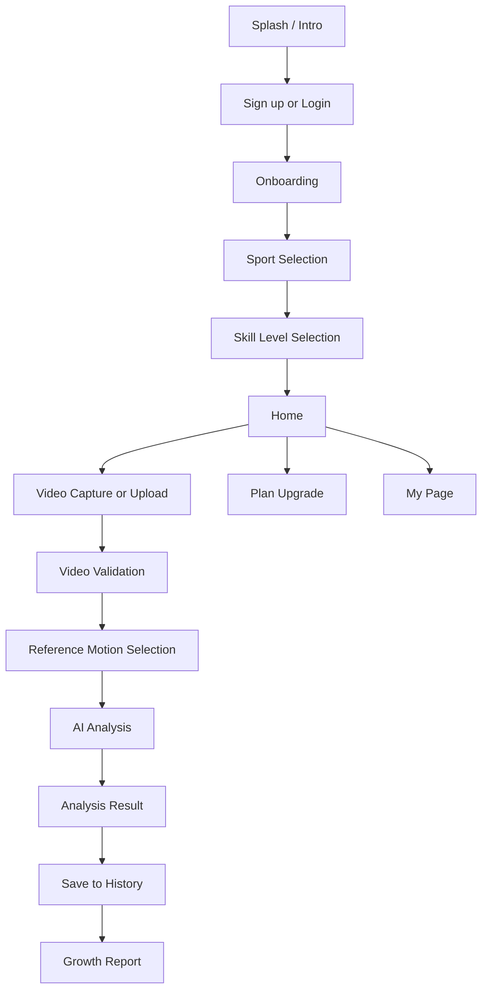

# Sunity AI Coach IA

> Source: Google Sheet `Sunity_AI_Coach_IA`  
> Purpose: Use this IA as the product-structure source of truth for Stitch, Figma extension, and development planning.

---

## 0. Product Summary

**Sunity AI Coach** is a mobile-first AI sports motion coaching app.

Users record or upload sports videos with a smartphone, choose a professional reference motion, receive AI posture analysis, and track their growth over time.

### MVP Focus

- Primary sport: **Pole Sports**
- Future expansion: Tennis, Jokgu, and other lifestyle sports
- Core value: **Record → Compare with pro motion → Get AI feedback → Track growth**

### Main User Flow

---

# 1. Sign Up / Login / Onboarding

## 1-0. Guest Mode (파일럿 전용)

> 파일럿 기간에는 회원가입 없이 앱을 바로 사용할 수 있어야 함.
> TestFlight 설치 후 즉시 분석 기능 접근 가능.

| ID | Screen / Function | State | Condition | Message | CTA |
|---|---|---|---|---|---|
| AC-GUEST-001 | Guest entry | 시작 화면 | 파일럿 모드 활성화 | 둘러보기로 시작하거나 로그인하세요. | 로그인 / 게스트로 시작하기 |
| AC-GUEST-002 | Guest onboarding | 종목 선택 | 로그인 없이 진행 | 종목을 선택해주세요. (나중에 계정 연동 가능) | 폴스포츠 선택 → 홈 |
| AC-GUEST-003 | Guest analysis | 분석 실행 | 게스트 상태 | 분석을 시작합니다. 결과를 저장하려면 로그인하세요. | 분석 진행 / 로그인 안내 |
| AC-GUEST-004 | Guest result | 결과 확인 | 분석 완료 | 결과를 확인하세요. 계정을 만들면 기록이 저장돼요. | 계정 만들기 / 나중에 |
| AC-GUEST-005 | Convert to account | 가입 유도 | 분석 2회 이상 | 기록이 쌓이고 있어요. 계정을 만들면 성장을 추적할 수 있어요. | 계정 만들기 |

### Guest Mode Notes

- 파일럿 기간에만 적용. 정식 출시 시 제거하거나 횟수 제한 적용.
- 게스트 분석 결과는 로컬 임시 저장 (앱 삭제 시 소멸).
- 계정 생성 시 게스트 데이터 이관 가능하면 이상적 (Phase 2).

---

## 1-1. Sign Up

| ID | Screen / Function | State | Condition | Message | CTA |
|---|---|---|---|---|---|
| AC-SIGN-001-0 | Splash / brand intro | First app launch | App 최초 실행 | AI 코치 Sunity를 시작해볼까요? | 시작하기 |
| AC-SIGN-001-1 | SNS sign up | Success | Google / Apple / Naver OAuth 성공 | 가입이 완료되었습니다. | 온보딩으로 자동 이동 |
| AC-SIGN-001-1E | SNS sign up | Fail | 사용자 거부 / API 오류 | 연동에 실패했습니다. 다시 시도해주세요. | 다시 시도 / 이메일로 가입 |
| AC-SIGN-002-1 | Email sign up | Valid email | @ 포함 + 도메인 존재 | 이메일이 확인되었습니다. | 다음 단계 활성화 |
| AC-SIGN-002-1E | Email sign up | Invalid email | @ 없음 / 도메인 누락 | 이메일 형식을 확인해주세요. | 입력창 안내 |
| AC-SIGN-002-1D | Email sign up | Duplicate email | DB 조회 결과 존재 | 이미 가입된 이메일입니다. 로그인하시겠어요? | 로그인 페이지 안내 |
| AC-SIGN-002-2 | Password setup | Valid password | 8자 이상, 특수문자 포함 | 안전한 비밀번호입니다. | 다음으로 이동 |
| AC-SIGN-002-2E | Password setup | Weak password | 6자 이하 / 단순 조합 | 더 복잡한 비밀번호가 필요합니다. | 안내 툴팁 |
| AC-SIGN-003-1 | Terms agreement | Required terms complete | 서비스/개인정보 체크 완료 | 가입이 완료되었습니다. | 온보딩 이동 |
| AC-SIGN-003-1E | Terms agreement | Required terms missing | 필수 체크 미완료 | 필수 항목을 모두 동의해주세요. | 해당 항목 하이라이트 |

### Sign Up Screens Required

- Sign up method selection
- SNS sign up success / failure
- Email input
- Password setup
- Terms agreement
- Required terms missing state
- Duplicate email state

---

## 1-2. Login

| ID | Screen / Function | State | Condition | Message | CTA |
|---|---|---|---|---|---|
| AC-LOGIN-001-0 | SNS login | Success | OAuth 인증 성공 + 유저 존재 | 로그인 성공! | 홈으로 이동 |
| AC-LOGIN-001-0E | SNS login | Fail | 거부 / 오류 / 미등록 | SNS 로그인에 실패했습니다. | 재시도 / 이메일 로그인 |
| AC-LOGIN-002-1 | Email login | Valid email | 가입 이메일 확인 | [이름]님, 반갑습니다. | 비밀번호 입력 활성화 |
| AC-LOGIN-002-1E | Email login | Invalid / unknown email | 형식 오류 / 미가입 계정 | 가입되지 않은 이메일입니다. | 회원가입 안내 |
| AC-LOGIN-003-1 | Password input | Match | 계정 활성 + 비밀번호 일치 | 로그인 성공! | 홈으로 이동 |
| AC-LOGIN-003-1E | Password input | Mismatch | 오입력 | 비밀번호가 틀렸습니다. 다시 입력해주세요. | 재입력 |
| AC-LOGIN-004-1 | Account status check | Inactive | 탈퇴 / 정지 계정 | 현재 사용할 수 없는 계정입니다. | 고객센터 안내 |
| AC-LOGIN-005-1 | Auto login | Selected | 토큰 저장 | 다음 로그인 시 자동으로 접속됩니다. | 세션 유지 |
| AC-LOGIN-007-1 | Password reset | Email exists | 회원 확인 | 비밀번호 재설정 링크를 보냈습니다. | 이메일 확인 |
| AC-LOGIN-007-1E | Password reset | Email not found | 미가입 이메일 | 해당 이메일이 존재하지 않습니다. | 다시 입력 / 회원가입 |
| AC-LOGIN-007-2 | New password | Valid | 조건 충족 | 비밀번호가 재설정되었습니다. | 로그인 하러 가기 |
| AC-LOGIN-007-2E | New password | Invalid | 조건 미충족 | 비밀번호 조건을 확인해주세요. | 다시 입력 |

### Login Screens Required

- SNS login
- Email login
- Password input
- Auto login checkbox
- Password reset request
- New password setup
- Account inactive notice

---

## 1-3. Onboarding

| ID | Screen / Function | Content | Message | CTA |
|---|---|---|---|---|
| AC-ONBD-001-1 | Slide 1 | Brand mission + value image | Sunity AI Coach에 오신 것을 환영합니다. | 다음 / 건너뛰기 |
| AC-ONBD-001-2 | Slide 2 | AI 분석 / 프로 비교 / 성장 기록 | 스마트폰으로 찍으면 AI가 분석해드려요. | 다음으로 |
| AC-ONBD-001-3 | Slide 3 | 촬영 → 분석 → 비교 → 리포트 | 오늘 내 동작이 프로에 얼마나 가까운지 확인해보세요. | 종목 선택으로 이동 |
| AC-ONBD-002 | Sport selection | 폴스포츠 활성 / 다른 종목 출시 예정 | 폴스포츠로 설정되었습니다. | 레벨 선택 |
| AC-ONBD-002E | Coming soon sport | 미출시 종목 클릭 | 곧 출시될 예정입니다. 알림을 받으시겠어요? | 알림 신청 / 닫기 |
| AC-ONBD-003 | Skill level | 입문 / 중급 / 고급 | [레벨]로 설정되었습니다. 나중에 마이페이지에서 변경 가능해요. | 홈으로 이동 |
| AC-ONBD-004 | Quick tutorial | 분석하기 / 기록보기 / 리포트 탭 설명 | 이제 시작할 준비가 됐어요! 첫 분석을 해볼까요? | 첫 분석 시작하기 |

### Onboarding Notes

- MVP 단계에서는 폴스포츠 단일 종목.
- 출시 예정 종목은 알림 신청 UI만 구현.
- 온보딩은 최초 1회 노출.
- 마이페이지 > 튜토리얼에서 재진입 가능.

---

# 2. Home & Sport Curation

## 2-1. Home Entry State

| ID | State | Content | Message | CTA |
|---|---|---|---|---|
| AC-HOME-001-1 | Logged in + sport selected + analysis exists | 최근 분석 요약 / 기준 모션 추천 / 성장 그래프 | [이름]님, 오늘도 연습해볼까요? | 분석 시작 |
| AC-HOME-001-1E | Logged in + sport selected + no analysis | Empty first-analysis card | 첫 분석을 시작해보세요! 프로와 얼마나 가까운지 확인해봐요. | 첫 분석하기 |
| AC-HOME-001-2 | Logged in + no sport selected | 제한 피드 + 종목 선택 유도 | 먼저 종목을 선택해주세요. 맞춤 피드를 보여드릴게요. | 종목 선택하기 |
| AC-HOME-001-3 | Not logged in | Service intro banner | Sunity AI Coach로 내 동작을 프로와 비교해보세요. | 로그인 / 회원가입 |

## 2-2. Home Feed Components

| ID | Component | Content | Condition | Message | CTA |
|---|---|---|---|---|---|
| AC-HOME-002-1 | Recent analysis card | 점수 / 종목 / 날짜 / 변화량 | 분석 결과 존재 | 분석 결과로 이동합니다. | 결과 상세 |
| AC-HOME-002-1E | Deleted analysis | Deleted state | 분석 데이터 없음 | 삭제된 분석입니다. | 닫기 |
| AC-HOME-002-2 | Reference motion recommendation | 기본기 / 중급 / 고급 카드 | 기준 모션 존재 | 이 동작으로 분석을 시작해볼까요? | 분석하기 |
| AC-HOME-002-3 | Growth graph preview | 최근 5회 분석 점수 | 분석 기록 2건 이상 | 기록 상세로 이동합니다. | 기록 탭 |
| AC-HOME-002-3E | Growth graph locked | Empty graph | 분석 기록 1건 이하 | 분석을 2번 이상 하면 성장 그래프를 볼 수 있어요. | 분석 시작하기 |
| AC-HOME-002-4 | Notice / event banner | 신규 기준 모션 / 이벤트 | 공지 활성화 | 공지 상세로 이동합니다. | 공지 상세 |

## 2-3. Sport Tabs

| ID | Tab | State | Message | CTA |
|---|---|---|---|---|
| AC-HOME-003-1 | Pole sports | Active | 폴스포츠 피드로 전환됩니다. | 피드 노출 |
| AC-HOME-003-2 | Coming soon sport | Disabled / waitlist | 곧 출시될 예정입니다. 알림을 신청하시겠어요? | 알림 신청 / 닫기 |

---

# 3. Video Input & AI Analysis

## 3-1. Video Source Selection

| ID | Source | State | Condition | Message | CTA |
|---|---|---|---|---|---|
| AC-VID-001-1 | Instant camera | Permission allowed | 권한 동의 | 가이드 앵글에 맞춰 촬영해주세요. | 촬영 시작 |
| AC-VID-001-1E | Instant camera | Permission denied | 권한 거부 | 카메라 권한이 필요합니다. 설정에서 허용해주세요. | 설정으로 이동 |
| AC-VID-001-2 | Album upload | File selected | 정상 파일 선택 | 영상을 확인 중입니다... | 업로드 진행 |
| AC-VID-001-2S | Album upload | File too large | 100MB 초과 | 100MB 이하 영상만 업로드 가능합니다. | 다른 파일 선택 |
| AC-VID-001-2F | Album upload | Unsupported file | mp4·mov 외 형식 | 지원하지 않는 파일 형식입니다. (mp4, mov 지원) | 다른 파일 선택 |

## 3-2. Sport-specific Capture Guide

| ID | Guide | Condition | Message | CTA |
|---|---|---|---|---|
| AC-VID-002-1 | Pole sports angle guide | 전신 / 폴 전체 / 측면 45° | 완벽해요! 분석을 시작합니다. | AI 분석으로 이동 |
| AC-VID-002-1E | Bad angle detected | 폴 전체가 안 보임 | 폴 전체가 화면에 보이지 않아요. 카메라를 조정해주세요. | 재촬영 |
| AC-VID-002-2 | Lighting / distance guide | 밝은 환경 / 2~3m 거리 | 환경이 좋아요. 분석 정확도가 높아집니다. | 촬영 계속 |

## 3-3. Video Validation

| ID | Validation | State | Condition | Message | CTA |
|---|---|---|---|---|---|
| AC-VID-003-1 | Person detection | Success | 관절 좌표 추출 가능 | 영상 확인 완료! 분석을 시작합니다. | 기준 모션 선택 |
| AC-VID-003-1E | Person detection | Fail | 영상에 사람 없음 | 영상에서 사람을 찾지 못했어요. 다시 촬영해주세요. | 재촬영 / 재업로드 |
| AC-VID-003-1B | Blur check | Fail | 화질 분석 불가 | 영상이 너무 흔들렸어요. 더 안정적으로 촬영해주세요. | 재촬영 |
| AC-VID-003-1L | Duration check | Fail | 3초 미만 | 영상이 너무 짧아요. 동작 전체가 담긴 영상이 필요해요. | 재업로드 |

---

## 3-4. Reference Motion Selection

| ID | Category | Examples | Message | CTA |
|---|---|---|---|---|
| AC-ANAL-001-1 | Basic | 인버전 자세 / 기본 그립 / 기초 자세 | [동작명]을 기준으로 비교합니다. | 분석 시작 |
| AC-ANAL-001-2 | Intermediate | 스핀 / 사이드클라임 / 기초 플로어 | [동작명]을 기준으로 비교합니다. | 분석 시작 |
| AC-ANAL-001-3 | Advanced | 플래그 / 핸드스프링 / 크로키 | [동작명]을 기준으로 비교합니다. | 분석 시작 |
| AC-ANAL-001-E | No motion selected | 선택 없이 시작 클릭 | 기준 동작을 먼저 선택해주세요. | 선택 화면 복귀 |

> Copy fix: Use **“비교할 프로 동작을 골라주세요.”** instead of **“기준이 될 프로모션을 골라주세요.”**

---

## 3-5. AI Analysis Execution

| ID | Step | State | Condition | Message | CTA |
|---|---|---|---|---|---|
| AC-ANAL-002-1 | Analysis waiting | In progress | 서버 정상 | 포즈를 분석하고 있어요... (예상 30~60초) | 취소 |
| AC-ANAL-002-1E | Server error / timeout | Fail | 분석 실패 | 분석 중 오류가 발생했습니다. 다시 시도해주세요. | 재시도 / 고객센터 |
| AC-ANAL-002-2 | Pose extraction | Success | 관절 좌표 데이터 확보 | 포즈 추출 완료. | 비교 단계 진행 |
| AC-ANAL-002-2E | Pose extraction | Fail | 관절 인식 불가 프레임 다수 | 포즈 추출에 실패했어요. 더 선명한 영상으로 다시 시도해주세요. | 재업로드 |
| AC-ANAL-002-3 | Motion comparison | Success | 유사도 점수 산출 | 분석이 완료되었습니다! | 결과 화면 |
| AC-ANAL-003-1 | Credit / plan check | Success | 유료 플랜 or 무료 잔여 | 분석을 시작합니다. | 분석 진행 |
| AC-ANAL-003-1E | Feature limit | Free plan advanced feature | 이 기능은 Basic 이상 플랜에서 사용 가능해요. | 업그레이드 안내 |

### Analysis Loading Stepper

Recommended UI steps:

1. 영상 프레임 추출 중
2. 관절 포인트 인식 중
3. 프로 동작과 비교 중
4. 리포트 생성 중

---

# 4. Analysis Result & Report

## 4-1. Result Screen

| ID | Section | Content | Message | CTA |
|---|---|---|---|---|
| AC-RES-001-1 | Score overview | 0–100 circular gauge + grade A/B/C/D | 분석이 완료되었습니다! 점수를 확인해보세요. | 상세 결과 |
| AC-RES-001-2 | Side-by-side comparison | 내 동작 좌 / 기준 모션 우 / 틀린 관절 하이라이트 | 이 구간에서 [관절명] 각도가 [N]° 차이나요. | 코칭 팁 보기 |
| AC-RES-001-3 | Coaching tips | 상위 3개 교정 포인트 카드 | [부위]를 [방향]으로 [N]° 더 기울여보세요. | 다음 팁 / 전체 보기 |
| AC-RES-001-4 | Detailed scores | 상체 / 하체 / 코어 / 밸런스 점수 | [항목]에서 [점수]점을 획득했어요. | 해당 파트 팁 |

## 4-2. Save & Share

| ID | Action | Content | Message | CTA |
|---|---|---|---|---|
| AC-RES-002-1 | Auto save | 분석 완료 즉시 기록 탭 저장 | 결과가 저장되었습니다. 기록 탭에서 확인하세요. | 기록 탭 바로가기 |
| AC-RES-002-2 | SNS share | 전후 비교 카드 이미지 자동 생성 | 공유 이미지가 생성되었습니다! | SNS 앱으로 이동 |
| AC-RES-002-2C | Share canceled | 공유 창 닫기 | 언제든 다시 공유할 수 있어요. | 결과 화면 복귀 |

---

# 5. Records & Growth Tracking

## 5-1. Analysis History

| ID | Section | State | Message | CTA |
|---|---|---|---|---|
| AC-REC-001-1 | History list | Records exist | 분석 결과로 이동합니다. | 결과 상세 |
| AC-REC-001-1E | History list | Empty | 아직 분석 기록이 없어요. 첫 분석을 시작해보세요! | 분석하기 |
| AC-REC-001-2 | History filter | Filter applied | 필터가 적용되었습니다. | 필터된 목록 |
| AC-REC-001-3 | Delete record | Delete confirmation | 이 기록을 삭제하시겠어요? 복구할 수 없습니다. | 삭제 / 취소 |

## 5-2. Growth Tracking

| ID | Section | State | Message | CTA |
|---|---|---|---|---|
| AC-REC-002-1 | Growth graph | 2+ records | 이번 주 평균 점수가 지난 주보다 [N]점 올랐어요! | 분석 결과로 이동 |
| AC-REC-002-1E | Growth graph | 1 or fewer records | 분석을 더 하면 성장 그래프를 확인할 수 있어요. | 분석 시작하기 |
| AC-REC-002-2 | Before/after comparison | 2 selected records | [날짜1] vs [날짜2] 비교 결과입니다. | 비교 결과 |
| AC-REC-002-3 | Weekly report | Auto generated weekly | 이번 주 [N]번 연습했어요. 가장 잘된 동작은 [동작명]이에요! | 리포트 상세 / 공유 |

---

# 6. Payment & Credits

## 6-1. Plan Policy

MVP policy: **No usage count limit; feature-based differentiation.**

| Plan | Price | Features | Message | CTA |
|---|---:|---|---|---|
| Free | 무료 | 기본 AI 분석 / 점수 확인 / 기록 7일 보관 | 무료로 기본 분석을 경험해보세요. | 분석 시작 / 업그레이드 |
| Basic | 월 9,900원 | 전체 AI 분석 / 무제한 기록 / 주간 리포트 / 교정 팁 전체 | Basic으로 업그레이드하면 모든 기능을 사용할 수 있어요. | 결제 진행 |
| Pro | 월 19,900원 | Basic 전체 + 클라우드 저장 확대 + 고화질 SNS 공유 + 우선 분석 | Pro로 업그레이드하면 더 많은 기록을 저장할 수 있어요. | 결제 진행 |

> Copy fix: Use **“무료로 계속 사용하기”** instead of **“Free 업그레이드.”**

## 6-2. Payment Flow

| ID | Screen | State | Message | CTA |
|---|---|---|---|---|
| AC-PAY-002-1 | Plan selection | Plan selected | [플랜명]을 선택했습니다. | 결제 수단 선택 |
| AC-PAY-002-2 | Payment method | Success | 구독이 시작되었습니다! 모든 기능을 이용해보세요. | 홈으로 이동 |
| AC-PAY-002-2E | Payment method | Fail | 결제에 실패했습니다. 결제 수단을 확인해주세요. | 다시 시도 / 다른 수단 |
| AC-PAY-003-1 | Subscription management | Plan changed | 플랜이 변경되었습니다. 다음 결제일부터 적용됩니다. | 마이페이지 |
| AC-PAY-003-2 | Cancel subscription | Canceled | 구독이 해지되었습니다. 현재 기간 만료 시까지 사용 가능해요. | Free 플랜 안내 |

## 6-3. Motion Pack

| ID | Screen | Content | Message | CTA |
|---|---|---|---|---|
| AC-PAY-004-1 | Motion pack list | 전문가 프리미엄 기준 모션 카드 | 이 모션팩으로 더 다양한 동작을 비교해보세요. | 구매 / 미리보기 |
| AC-PAY-004-2 | Motion pack purchase | Single purchase | 모션팩이 추가되었습니다! 바로 분석에 사용해보세요. | 분석 시작 |

---

# 7. Gamification

## 7-1. Level & Points

| ID | Feature | Trigger | Message | CTA |
|---|---|---|---|---|
| AC-GAME-001-1 | Level up | 분석 횟수 + 점수 누적 조건 충족 | 레벨업! Lv.[N]이 되었어요! 🎉 | 다음 목표 안내 |
| AC-GAME-001-1E | Next level guide | 레벨 조건 미충족 | 다음 레벨까지 [N]번 더 연습하면 돼요! | 분석하기 |
| AC-GAME-001-2 | Points | 전 회차 대비 점수 상승 | 점수가 [N]점 올랐어요! [P] 포인트를 드렸어요. | 포인트 잔액 업데이트 |
| AC-GAME-001-3 | Streak bonus | 7일 연속 분석 | 7일 연속 훈련 달성! 보너스 포인트를 드렸어요. 🔥 | 보너스 팝업 |
| AC-GAME-001-4 | Point use | 포인트 충분 | [P] 포인트를 사용했습니다. 잔액: [남은P]P | 사용 완료 |
| AC-GAME-001-4E | Point use | 포인트 부족 | 포인트가 부족해요. 더 많은 분석으로 모아보세요! | 분석하기 / 구독 안내 |

## 7-2. Achievement Badges

| ID | Badge | Trigger | Message |
|---|---|---|---|
| AC-GAME-002-1 | First analysis badge | 최초 분석 완료 | 첫 분석 완료 배지를 획득했어요! 🏅 |
| AC-GAME-002-2 | Streak badge | 7일 / 30일 연속 분석 | [N]일 연속 훈련 배지를 획득했어요! 💪 |
| AC-GAME-002-3 | High-score badge | 90점 이상 첫 달성 | 90점 돌파! 프로에 가까워졌어요! ⭐ |

> MVP: 레벨·배지 UI만 표시. 실제 지급 로직은 베타 단계 적용 권장.

---

# 8. My Page & Settings

| ID | Section | Content | Message | CTA |
|---|---|---|---|---|
| AC-MY-001-1 | Profile | 닉네임 / 사진 / 주 종목 / 레벨 수정 | 프로필이 업데이트되었습니다. | 마이페이지 복귀 |
| AC-MY-001-2 | Main sport change | 온보딩 종목 재선택 | 주 종목이 [종목명]으로 변경되었습니다. | 홈 피드 업데이트 |
| AC-MY-002-1 | Subscription | 현재 플랜 / 다음 결제일 / 변경·해지 | 현재 [플랜명] 구독 중입니다. 다음 결제일: [날짜] | 플랜 변경 / 해지 |
| AC-MY-003-1 | Notification settings | 분석 완료 / 레벨업 / 주간 리포트 / 이벤트 토글 | 알림 설정이 변경되었습니다. | 설정 저장 |
| AC-MY-004-1 | Password change | 현재 비밀번호 → 새 비밀번호 | 비밀번호가 변경되었습니다. | 로그인 화면 |
| AC-MY-004-2 | Account deletion | 탈퇴 사유 → 최종 확인 | 계정이 삭제되었습니다. 그동안 Sunity를 이용해주셔서 감사합니다. | 앱 초기 화면 |
| AC-MY-004-2C | Account deletion cancel | 취소 | 탈퇴가 취소되었습니다. | 마이페이지 복귀 |
| AC-MY-005-1 | Tutorial replay | 온보딩 튜토리얼 재실행 | Sunity 사용법을 다시 알아볼까요? | 투어 완료 / 건너뛰기 |

---

# 9. Screen Coverage Checklist

## Existing or Already Partially Designed in Figma

- Intro / splash
- Tutorial
- Start screen
- Sign up
- Login
- Password reset
- Notification permission
- Sport selection
- Skill level selection
- Home
- Video source selection
- Camera permission
- Motion selection
- AI analysis loading
- AI analysis error states
- Plan guide

## High-priority Missing / Incomplete Screens for Stitch

1. AI analysis result screen
2. Result detail screen with side-by-side comparison
3. Coaching tip detail
4. Part score detail
5. Analysis history list
6. Analysis history empty state
7. Growth report
8. Weekly report detail
9. Before/after comparison
10. My page
11. Profile edit
12. Notification settings
13. Subscription management
14. Plan comparison detail
15. Payment method
16. Payment success / failure
17. Motion pack list
18. Motion pack detail
19. Badge / level popup
20. Account deletion flow

---

# 9-1. Admin — 기준 모션 관리 (관리자 전용)

> 정은지 선수 기준 모션 등록 및 관리를 위한 관리자 플로우.
> 일반 사용자 앱이 아닌 내부 관리 도구 또는 백엔드 API로 구현.

## 기준 모션 등록

| ID | Screen / Function | State | Condition | Message | CTA |
|---|---|---|---|---|---|
| AC-ADMIN-001-1 | Reference motion upload | 영상 선택 | mp4 / mov, 100MB 이하 | 영상을 선택해주세요. | 파일 선택 |
| AC-ADMIN-001-2 | Motion metadata input | 정보 입력 | 영상 업로드 완료 | 동작 정보를 입력해주세요. | 저장 |
| AC-ADMIN-001-3 | Keypoint extraction | 처리 중 | 파이프라인 실행 | 키포인트를 추출하고 있습니다. (30~60초) | 대기 |
| AC-ADMIN-001-4 | Extraction result | 성공 | 키포인트 정상 추출 | 기준 모션이 등록되었습니다. 앱에서 바로 사용 가능합니다. | 목록으로 |
| AC-ADMIN-001-4E | Extraction result | 실패 | 인식 불가 프레임 다수 | 키포인트 추출에 실패했습니다. 더 선명한 영상으로 다시 시도해주세요. | 재업로드 |

### 기준 모션 메타데이터 필드

| 필드 | 예시 | 필수 |
|------|------|------|
| 기술명 (한글) | 파이어맨스핀 | ✅ |
| 기술명 (영문 ID) | fireman_spin_basic | ✅ |
| 선수명 | 정은지 | ✅ |
| 레벨 | basic / intermediate / advanced | ✅ |
| 설명 | 폴에 기대어 회전하는 기초 기술 | 선택 |

## 기준 모션 목록 관리

| ID | Screen / Function | State | Condition | Message | CTA |
|---|---|---|---|---|---|
| AC-ADMIN-002-1 | Motion list | 목록 조회 | 등록된 모션 있음 | 전체 [N]개의 기준 모션이 등록되어 있습니다. | 추가 / 수정 / 비활성화 |
| AC-ADMIN-002-2 | Motion deactivate | 비활성화 | 앱 노출 중단 필요 | 이 모션을 앱에서 숨기겠습니까? | 확인 / 취소 |

### Admin Notes

- MVP 단계: 별도 관리자 UI 없이 Firestore 콘솔에서 직접 처리 가능.
- 파일럿 전 정은지 선수 기술 최소 3개 등록 필요 (기초 1~2개 + 중급 1개).
- 등록 후 앱 기준 모션 선택 화면(AC-ANAL-001)에 자동 반영.

---

# 10. Stitch Generation Rule

Use this IA to identify screen coverage.

1. Compare this IA against the uploaded Figma file.
2. Do not duplicate screens already sufficiently designed.
3. Prioritize IA screens that are missing from Figma.
4. For partially designed screens, add missing states.
5. Preserve the existing Sunity visual style.
6. Use `#FF4B33` as the primary action color.
7. Use Pretendard as the primary font.
8. Keep mobile width at 390px.
9. Create developer-ready components and consistent states.
