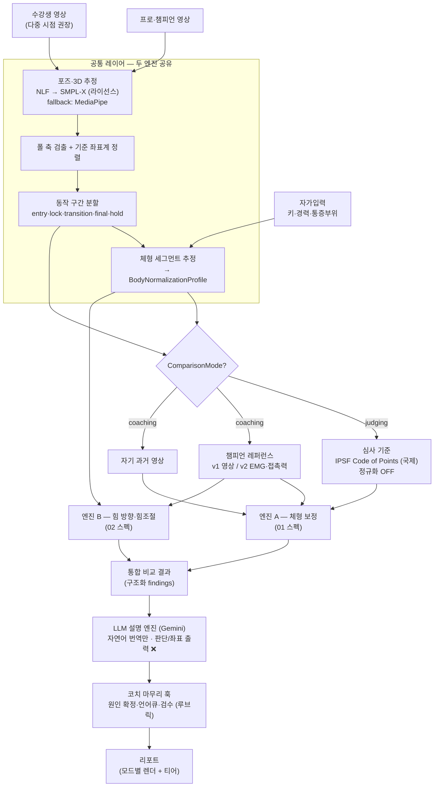
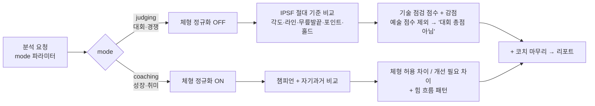
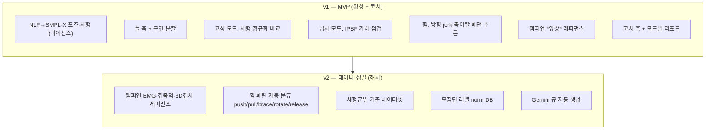

# 폴스포츠 AI 모션 분석 — 시스템 아키텍처 (최종 / 캡스톤)

> 대상: Claude Code / Codex / CLI 기반 개발 AI
> 역할: 아래 두 엔진 스펙을 하나로 묶는 **상위 아키텍처 문서**. 먼저 이 문서를 읽고, 엔진별 상세는 각 스펙을 참조한다.
> - `01_체형차이_보정엔진_FINAL.md`
> - `02_힘방향_힘조절_엔진_FINAL.md`

---

## ✅ 확정 결정 (이번에 잠금)

| 항목 | 결정 | 영향 |
|---|---|---|
| **심사 기준 표준** | **IPSF (국제폴스포츠연맹) Code of Points** | `JudgingStandard` 기본값 = `'IPSF'`. 심사 모드의 절대 기준은 IPSF 코드. (POSA·국내 연맹은 추후 옵션) |
| **MVP 포즈 엔진** | **NLF → SMPL-X (라이선스 경로)** | 3D 포즈+체형을 v1부터 확보 → 체형 정규화가 v1에서 제대로 작동. MediaPipe는 라이선스/일정 막힐 때 fallback |

> 액션 아이템(개발 착수 전): **NLF 상업 라이선스 협의**(저자/Max Planck) **+ SMPL-X 상업 라이선스(Meshcapade)** 확보. NLF 공개 가중치는 비상업 연구용이므로 상업 배포 전 필수.

---

## 1. 마스터 아키텍처



---

## 2. 두 모드 분기 (가장 중요한 설계)



- **같은 엔진, 출력 프레임만 다르다. 섞지 말 것.**
- 심사 모드: 절대값(정규화 X) — "대회 기준 얼마나 되나".
- 코칭 모드: 체형 정규화(O) + 챔피언/자기과거 — "네 체형 기준 보정점".

---

## 3. 컴포넌트 책임

| 컴포넌트 | 책임 | 산출/계약 | 비고 |
|---|---|---|---|
| 포즈·3D 추정 | 관절·체형 3D 추정 | `PoseFrame`, `SmplxShapeParams` | NLF→SMPL-X (라이선스) |
| 폴 축 검출 | 폴 기준 좌표계 | `PoleAxis` | 모든 분석 정렬 기준 |
| 구간 분할 | 동작 단계 분리 | phase 태그 | entry/lock/transition/final/hold |
| 체형 세그먼트 | 비율·정규화 프로파일 | `BodyNormalizationProfile` | **두 엔진 공유 입력** |
| 엔진 A (체형) | 정규화 비교 + 심사 기하 점검 | `BodyComparisonReport`, `JudgingModeReport` | 01 스펙 |
| 엔진 B (힘) | 방향 패턴·힘조절 실패 추론 | `ForceComparisonFinding`, `ForcePatternInference` | 02 스펙. 힘 측정 ❌, 패턴 추론 |
| 기준 프레임 | 비교 대상 제공 | IPSF 코드 / 챔피언 레퍼런스 / 자기과거 | §1 |
| LLM 설명 (Gemini) | 구조화 결과 → 자연어 | 문장 | **판단·좌표 출력 금지**, 번역만 |
| 코치 훅 | 원인 확정·언어큐·검수 | `CoachCommentHook` | 루브릭 표준화 |
| 리포트 | 모드/티어별 렌더 | 리포트 객체 | AI / AI+코치 / AI+챔피언 |

---

## 4. 공통 데이터 계약 (두 엔진이 합의하는 타입)

```ts
type ComparisonMode = 'judging' | 'coaching';
type ReferenceFrame  = 'judging_criteria' | 'champion_reference' | 'self_progress';
type JudgingStandard = 'IPSF' | 'POSA' | 'KR_FEDERATION' | 'CUSTOM'; // 기본값 'IPSF'

// 공통 레이어 산출 — 두 엔진의 공유 입력
type BodyNormalizationProfile = {
  estimatedHeightScale: number;
  armScale: number; legScale: number; torsoScale: number;
  shoulderHipRatio: number;
  confidence: number;          // 낮으면 단정 금지
  warnings: string[];          // 'low_3d_confidence' | 'occlusion_detected' ...
};

// 모든 리포트에 부착되는 코치 마무리 훅
type CoachCommentHook = {
  autoFindingsSummary: string;        // AI 자동 도출
  openQuestionsForCoach: string[];    // 코치가 확정할 것(원인·체형판단·안전)
  suggestedCues?: string[];           // Gemini 큐 후보(코치 검수)
  coachComment?: string;              // 프리미엄 티어
  reviewedBy?: 'none' | 'coach' | 'champion';
};
```

> 상세 스키마(`PoseFrame`, `JudgingModeReport`, `ForceComparisonFinding` 등)는 각 엔진 스펙 참조.

---

## 5. AI vs 코치 경계 (= 측정 가능성 경계)

| 항목 | 영상 측정 | 담당 |
|---|---|---|
| 체형 비율·대칭 / 관절 각도·라인·홀드 | ✅ | AI |
| 움직임/궤적 방향·순서·타이밍 | ✅ | AI (엔진 B) |
| 힘조절 품질(흔들림·jerk·고정실패) | ✅ 간접 | AI (엔진 B) |
| 몸무게/체구 | ⚠️ | 자가입력 |
| 근육 힘의 *방향*(내부) | ❌ | 챔피언 EMG(v2) + 코치 |
| 근육량·절대 근력 | ❌ | 자가입력 + 코치 |
| 실패의 *원인* | ❌ | **코치** |
| 예술·안무·표현 | ❌ | 심사위원/코치 |

**원칙:** "영상으로 안 잡히는 것" = "코치가 마무리하는 것". AI는 측정 가능한 것만 단정하고, 나머지는 "가능성"으로 표기 → 코치 훅으로 위임. 이 경계가 **AI+코치 프리미엄 모델**의 근거다.

---

## 6. 빌드 단계 (v1 → v2)



| 단계 | 핵심 | 절대 약속 금지 |
|---|---|---|
| v1 | 영상 측정 가능한 것 + 코치 마무리 | 근육량/근력 단정, 온-폴 inverse dynamics 근력 |
| v2 | 챔피언 EMG 등 *측정된* 레퍼런스(해자) + 자동 분류 | 동일 |

---

## 7. 확정 결정 & 남은 결정

**확정:** ① 심사 기준 = IPSF(국제) · ② MVP 포즈 = NLF→SMPL-X(라이선스, fallback MediaPipe).

**개발 착수 전 남은 결정:**
- NLF/SMPL-X 라이선스 협의 결과(비용·조건) → 안 되면 MediaPipe fallback로 v1 일정 재조정.
- v1 대상 동작 범위(3~5개 핵심/빈번 실패 동작부터 — 전체 동작 커버 금지).
- 챔피언 캡처 프로토콜(v1 영상 다각도 / v2 EMG·접촉력) 일정.
- 코치 코멘트 루브릭·템플릿 표준 설계.

---

## 8. 기술·라이선스 요약

| 레이어 | v1 선택 | 라이선스/주의 |
|---|---|---|
| 포즈·3D·체형 | **NLF → SMPL-X** | NLF 비상업 가중치 → 상업 라이선스 협의 / SMPL-X = Meshcapade |
| 심사 기준 | **IPSF Code of Points** | 공개 코드(기하 임계값). 몇 년마다 개정 → 버전 관리 |
| 힘 패턴 | 운동학 휴리스틱(자체) | 가림 스무딩·confidence 게이트 |
| 설명 | Gemini | 번역 전용. 좌표/판단 금지 |
| (대안) 턴키 | Uplift / Kemtai / Sency | 폴 특화·기준은 직접 정의 |
| (v2) 챔피언 측정 | EMG(Myontec/Athos·Delsys/Noraxon), 접촉력(Tekscan/로드셀), 3D(Theia3D/Vicon) | 해자 데이터셋 |
| (오프-폴만) 생체역학 | OpenSim/AnyBody | **온-폴 근력 추정 금지** |

---

## 9. 한 줄 요약

> **NLF→SMPL-X로 체형을 정규화하고, IPSF 코드(심사 모드)와 챔피언 레퍼런스(코칭 모드)라는 두 기준으로 비교하되, 영상으로 못 재는 것(근육 힘 방향·원인·근력)은 챔피언 EMG와 코치 마무리로 채우는 — "AI 측정 + 전문가 완성" 시스템.**
