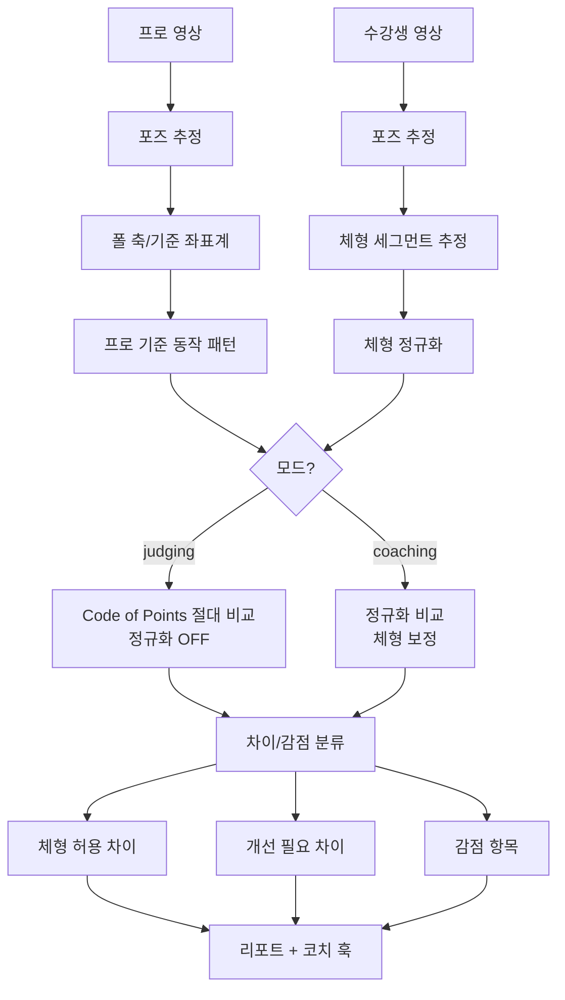

# 폴스포츠 AI 모션 분석 — 체형 차이 보정 엔진 (최종 / v1 개발 스펙)

> 대상: Claude Code / Codex / CLI 기반 개발 AI
> 목적: 프로(세계 챔피언) 모션과 수강생 모션을 비교할 때, ① 체형 차이로 인한 오판을 줄이고, ② 동시에 "대회 심사 기준(절대)"과 "코칭(체형 보정)"을 분리해 제공하는 분석 엔진을 설계한다.
> 짝 문서: **`02_힘방향_힘조절_엔진_FINAL.md`** — 이 두 엔진은 하나의 파이프라인을 공유한다. 0장은 두 문서가 동일하다.

---

## 0. 시스템 컨텍스트 (먼저 읽을 것 — 두 문서 공통)

### 0.1 전체 파이프라인

```
영상 입력 (userType: pro_reference | student)
  → [공통] 포즈·3D 추정 (MVP: MediaPipe / 고도화: NLF→SMPL-X)
  → [공통] 폴 축 검출 & 기준 좌표계 정렬
  → [공통] 동작 구간 분할 (entry / lock / transition / final_shape / hold)
  → [공통] 체형 세그먼트 추정 → BodyNormalizationProfile
  → ├── 엔진 A: 체형 차이 보정          ← 이 문서
  │   └── 엔진 B: 힘 방향·힘조절 패턴    ← 짝 문서 (BodyNormalizationProfile를 입력으로 소비)
  → 통합 비교 결과 (구조화된 findings)
  → [공통] LLM 설명 엔진 (Gemini): 판단이 아니라 자연어 번역만
  → [공통] 코치 마무리 훅: 구조화된 결과에 전문가 코멘트 부착
  → 리포트 (모드/기준 프레임에 맞춰 렌더)
```

### 0.2 세 가지 비교 기준 프레임 (Reference Frame)

모든 분석은 아래 세 기준 중 하나 이상에 대해 수행한다. 어느 기준을 쓰는지에 따라 "정규화 여부"와 "메시지"가 달라진다.

```ts
type ReferenceFrame =
  | 'judging_criteria'   // 절대·객관. IPSF/POSA Code of Points. 정규화 ❌. "대회 기준 얼마나 되나"
  | 'champion_reference' // 열망 모범. 세계 챔피언 동작. 정규화 ✅. "최고는 이렇게 한다"
  | 'self_progress';     // 자기 성장. 본인 과거 영상. "지난번보다 나아졌나"
```

### 0.3 두 가지 모드 (가장 중요한 설계 분기)

| 모드 | 체형 정규화 | 기준 프레임 | 대상 | 출력 메시지 톤 |
|---|---|---|---|---|
| **심사 모드** (`judging`) | ❌ **안 함** | judging_criteria | 대회 준비·진지한 수강생 | "코드 기준 무릎-발끝 정렬 -X, 라인 -Y → Z점" |
| **코칭 모드** (`coaching`) | ✅ **함** | champion_reference + self_progress | 배우는 수강생 | "네 체형 기준으로는 이 부분을 보정해라" |

```ts
type ComparisonMode = 'judging' | 'coaching';
```

- **같은 엔진, 출력 프레임만 다르다. 절대 섞지 말 것.** 모드는 분석 요청 시 입력 파라미터로 받는다.
- 심사 모드는 "대회에선 스플릿이 체형과 무관하게 180°"라는 *절대 기준*이라 정규화하지 않는다.
- 코칭 모드는 "네 비율 기준 최적"을 위해 반드시 정규화한다.
- 이 분기가 본 문서의 "각도=정답 아님" 원칙과 "Code of Points 절대 기준"의 충돌을 푸는 핵심이다.

### 0.4 영상으로 잡히는 것 vs 안 잡히는 것 (= AI vs 코치 경계)

| 항목 | 영상 직접 측정 | 담당 |
|---|---|---|
| 키·팔/다리 비율, 어깨/골반폭, 좌우 비대칭 | ✅ 가능 | AI (포즈·세그먼트) |
| 관절 각도·라인·스플릿·홀드 (기하) | ✅ 가능 | AI (이 엔진) |
| 움직임/궤적의 방향·순서·타이밍 | ✅ 가능 | AI (짝 엔진) |
| 힘 조절 품질 (흔들림·jerk·고정 실패) | ✅ 간접 | AI (짝 엔진) |
| 몸무게/체구 | ⚠️ 영상 부정확 | 자가입력 1회 (키+몸무게) |
| **근육이 당기는 힘의 방향** | ❌ 불가 | 챔피언 EMG 레퍼런스(v2) + 코치 |
| 근육량·절대 근력 | ❌ 불가 | 자가입력 + 누적 신호 + 코치 |
| 동작 실패의 *원인* (근력 vs 기술 vs 가동성 vs 공포) | ❌ 불가 | **코치** |
| 예술·안무·표현 (대회 점수의 큰 비중) | ❌ 불가 | 심사위원/코치 |

**원칙: "영상으로 안 잡히는 것"의 목록 = "코치가 마무리하는 것"의 목록이다.** AI는 측정 가능한 것만 단정하고, 나머지는 전부 "가능성(possibility)"으로 표기해 코치에게 넘긴다.

### 0.5 AI + 코치 = 완성 (제품 포지셔닝)

- **AI 80%** (측정·정규화·패턴 추출·1차 후보) + **코치 20%** (원인 확정·체형별 판단·언어 큐·검수).
- **절대 "AI 단독 코칭"으로 만들지 말 것** — 고객·강사 모두 AI 단독 판단을 불신한다(고객검증 결과).
- 모든 분석 결과는 전문가 코멘트가 붙을 수 있게 구조화한다 (`coachCommentHook`).
- 상품 티어: ① AI 리포트(즉시) → ② AI + 코치 코멘트(프리미엄) → ③ AI + 세계 챔피언 코멘트(럭셔리).
- 강사는 *대체*가 아니라 *증폭*된다 → "선생님 피드백을 시각화/구조화하는 도구"로 포지셔닝.

### 0.6 v1 / v2 범위

- **v1 (이 스펙의 목표)**: 포즈 추정 + 폴 축 정렬 + 체형 세그먼트 추정 + 코칭 모드(체형 정규화 비교) + 심사 모드(기하 기준 점검) + 구조화된 코치 훅.
- **v2**: NLF/SMPL-X 정밀 3D, 체형군별 기준 데이터셋, 모집단 레벨 norm DB, EMG 기반 힘 레퍼런스(짝 문서).
- **절대 약속 금지**: 영상만으로 근육량/근력 단정, 온-폴 inverse dynamics 근력 측정.

### 0.7 포즈 엔진 선택 & 라이선스/리스크 (구현 필수 인지)

| 옵션 | 특성 | 비고 |
|---|---|---|
| MediaPipe Pose / MoveNet | 무료·빠름·2D/2.5D | MVP 시작점. 단, **체형 shape 추정이 약함** |
| **NLF** (Neural Localizer Fields, NeurIPS 2024) | SOTA 3D 포즈+체형, 임의 신체점 질의, SMPL-X 피팅 | ⚠️ **공개 가중치는 비상업 연구용** → 상업화 시 라이선스 협의 또는 자체 학습 필요 |
| SMPL / SMPL-X (Meshcapade) | 파라메트릭 체형 모델 (shape↔pose 분리) | 상업 라이선스 Meshcapade 통해. NLF 출력을 SMPL-X로 표현 가능 |
| Uplift Labs / Kemtai / Sency | 상용 모션 SDK (턴키) | 빠른 베이스. 단 **폴 특화·기준은 직접 정의해야 함** |

- ⚠️ **폴 특유 리스크 — 가림(occlusion)**: 몸이 봉을 감싸고 접촉하면 포즈 정확도가 급락한다(특히 횡단면 각도 오차 큼). 필수 완화책: **다중 시점 촬영**, 시간적 스무딩, confidence 임계값 적용, **신뢰도 낮은 프레임은 단정하지 말고 "추정"으로 표기 + 수동 키프레임 보정 옵션**.
- **체형 정규화의 본질은 3D 형상**이 있어야 제대로 된다. MVP를 2D+휴리스틱으로 시작하더라도, 정규화 신뢰도(`bodyNormalizationConfidence`)를 항상 출력하고, 낮으면 단정 금지.

---

## 1. 핵심 결론 (이 엔진의 원칙)

체형 보정은 **프로와 수강생의 겉모양을 똑같이 맞추는 기능이 아니다.**

> **프로의 동작 성공 *원리*를 수강생의 신체 비율에 맞게 재해석해 비교하는 것.**

예: 프로 다리 각도 110°, 수강생 100°라고 무조건 감점하면 안 된다 — 키·다리길이·골반구조·유연성·팔길이에 따라 같은 동작의 정상 허용범위가 달라진다. (단, **심사 모드에서는 예외** — 0.3 참조. 대회 기준은 절대값이다.)

엔진은 두 출력 프레임을 가진다:
- **코칭 모드**: 신체 비율 대비 관절 흐름·중심축·접촉점·가동범위를 비교 → "네 체형 기준 보정점".
- **심사 모드**: Code of Points 절대 기준으로 기하 점검 → "대회 기준 감점/점수".

---

## 2. 심사 모드 — Code of Points 절대 기준 레이어 (신규)

### 2.1 배경

폴스포츠엔 공식 채점 코드가 있다 (IPSF Code of Points 2025–2027 현행, POSA 별도 코드). 채점은 4부분 — Technical Bonus / Technical Deductions / Artistic & Choreography / Compulsories. **이 중 기술·실행 감점이 거의 다 기하학적**이라 포즈 추정으로 측정 가능하다:

- 무릎-발끝 정렬(슬개골→엄지발가락 직선), 발끝 포인트
- 동작의 각도, "정확한 라인보다 약간 위/아래" 이탈
- 요소 최소 요건 미충족 시 해당 요소 0점
- 홀드/밸런스/컨트롤

> **단, 예술·안무·표현(창의성·음악성)은 주관 영역 → 자동 채점에서 제외.** 따라서 자동 점수는 절대 "대회 총점 예측"이 아니라 **"심사 기준 기반 기술 점검"**으로만 표기한다. 이게 경쟁 점수의 큰 비중이라 과장하면 신뢰를 잃는다.

### 2.2 임계값 출처 (두 시점)

- **(a) 코드 정의 임계값** (라인 요건·감점 컷·요소 최소요건): 공개 CoP에서 즉시 확보 = v1 절대 기준.
- **(b) 모집단·레벨 norm** ("중급 평균 X°", "같은 레벨 또래 중 위치"): day1엔 없음 → 자체 사용자 데이터 누적으로 구축(데이터 플라이휠·해자) = **v2 자산**.

### 2.3 스키마

```ts
type JudgingStandard = 'IPSF' | 'POSA' | 'KR_FEDERATION' | 'CUSTOM';

type GeometricCriterion = {
  criterionId: string;          // 예: 'split_angle', 'knee_toe_alignment', 'pointed_feet', 'line_straightness'
  movementName: string;
  phase: 'entry' | 'lock' | 'transition' | 'final_shape' | 'hold';
  metric: 'angle' | 'line_deviation' | 'alignment' | 'hold_duration_ms' | 'symmetry';
  targetValue: number;          // 코드 기준 (절대)
  toleranceFull: number;        // 감점 없는 허용 오차
  deductionPerStep: number;     // 초과 시 단계별 감점
  minimumRequirement?: number;  // 미충족 시 요소 0점
};

type DeductionFinding = {
  criterionId: string;
  phase: string;
  measuredValue: number;
  deviation: number;
  deductionApplied: number;
  metRequirement: boolean;
  note: string;                 // "심사 기준 기반 기술 점검 — 예술 점수 제외" 명시
  confidence: number;
};

type JudgingModeReport = {
  standard: JudgingStandard;
  movementName: string;
  technicalSubscore: number;    // 자동 채점 가능한 기술/실행 부분만
  deductions: DeductionFinding[];
  disclaimer: string;           // "예술·안무 점수 미포함. 대회 총점 아님."
  coachCommentHook: CoachCommentHook;
};
```

> **심사 모드에서는 체형 정규화 OFF.** `normalizeStudentPoseToProReference`를 호출하지 않고, 절대 좌표/각도를 코드 기준과 직접 비교한다.

---

## 3. 개발하지 말아야 할 것

| 금지/후순위 기능 | 이유 |
|---|---|
| (코칭 모드에서) 프로와 수강생의 절대 각도만 비교 | 체형 차이로 잘못된 피드백 |
| "프로보다 10도 부족" 식 단순 감점 (코칭 모드) | 실질 개선 방향을 못 줌 |
| 하나의 정답 자세 강요 | 폴은 체형·유연성·힘 방향에 따라 쉐입 차이 큼. "프로와 다름 ≠ 틀림" |
| 체형 보정 없이 코칭 모드 점수화 | 신뢰도 하락·전문가 반발 |
| 몸무게/근육량을 영상으로 추정해 단정 | 영상만으론 불가. 자가입력/센서 필요 |
| 자동 점수를 "대회 총점"으로 표기 | 예술 점수 미포함. 기술 점검으로만 |
| 가림 무시하고 저신뢰 프레임 단정 | occlusion으로 오판. confidence 게이트 필수 |

---

## 4. 주요 입력값

### 4.1 영상 입력

```ts
type MotionVideoInput = {
  videoId: string;
  userType: 'pro_reference' | 'student';
  movementName: string;
  videoUrl: string;
  fps?: number;
  cameraView?: 'front' | 'side' | 'diagonal' | 'unknown';
  cameraViews?: MotionVideoInput[]; // 다중 시점(가림 완화). 가능하면 권장
  mode: ComparisonMode;             // 'judging' | 'coaching'
  referenceFrames: ReferenceFrame[];
};
```

### 4.2 사용자 자가입력 (영상으로 단정 말 것)

```ts
type BodyProfileInput = {
  userId: string;
  heightCm?: number;               // 자가입력. 정확히 알 수 있음
  weightKg?: number;               // 선택. 분석 단정에는 사용 금지
  dominantSide?: 'left' | 'right' | 'unknown';
  poleExperienceLevel?: 'beginner' | 'intermediate' | 'advanced' | 'pro';
  knownLimitations?: string[];     // 'shoulder_mobility' | 'hip_mobility' | 'backbend' | 'wrist_pain' ...
};
```

> 유연성·근력 자가입력은 부정확하니 *단정 근거로 쓰지 말 것*. 키·몸무게는 정확히 알 수 있으므로 OK(단 weight는 보조).

### 4.3 포즈 추정 결과

```ts
type PoseFrame = {
  frameIndex: number;
  timestampMs: number;
  keypoints2D: Record<string, { x: number; y: number; confidence: number }>;
  keypoints3D?: Record<string, { x: number; y: number; z: number; confidence: number }>;
  bodyShape?: SmplxShapeParams;    // NLF/SMPL-X 사용 시 체형 파라미터
};
```

필수 관절: nose/head, left/right_shoulder, left/right_elbow, left/right_wrist, left/right_hip, left/right_knee, left/right_ankle, left/right_heel, left/right_foot_index.

---

## 5. 핵심 계산값

### 5.1 신체 세그먼트 길이

```ts
type BodySegmentLengths = {
  upperArmLeft: number; upperArmRight: number;
  forearmLeft: number; forearmRight: number;
  torso: number;
  thighLeft: number; thighRight: number;
  shinLeft: number; shinRight: number;
  shoulderWidth: number; hipWidth: number;
  legLengthRatio: number; armLengthRatio: number; torsoLegRatio: number;
};
```

### 5.2 체형 정규화 지표

```ts
type BodyNormalizationProfile = {
  estimatedHeightScale: number;  // 프로 대비 신장 스케일
  armScale: number; legScale: number; torsoScale: number;
  shoulderHipRatio: number;
  confidence: number;            // 낮으면 단정 금지
  warnings: string[];            // 예: 'low_3d_confidence', 'occlusion_detected'
};
```

> `BodyNormalizationProfile`는 **짝 문서(힘 엔진)의 입력이기도 하다.** 두 엔진이 같은 정규화 결과를 공유한다.

---

## 6. 분석 흐름



---

## 7. 비교 기준

### 7.1 비교하면 안 되는 것 (코칭 모드)
프로/수강생의 절대 키, 절대 다리 높이, 절대 팔 위치, 프로 쉐입 외형 그대로, 단일 프레임 각도 하나.

### 7.2 비교해야 하는 것 (코칭 모드)
신체 비율 대비 관절 위치 / 폴 축 기준 골반·어깨·흉곽 위치 / 접촉점과 중심축 관계 / 진입→고정→전환→완성→유지 단계의 관절 흐름 / **체형 보정 후에도 반복적으로 벗어나는 차이**.

> 심사 모드에서는 7.1을 *반대로* 적용한다 — 절대 각도/라인이 곧 기준이다.

---

## 8. 체형 보정 알고리즘 초안 (코칭 모드)

```ts
function normalizeStudentPoseToProReference(
  proPose: PoseFrame[],
  studentPose: PoseFrame[],
  proBody: BodyNormalizationProfile,
  studentBody: BodyNormalizationProfile
): NormalizedComparisonResult {
  const alignedPro = alignToPoleAxis(proPose);
  const alignedStudent = alignToPoleAxis(studentPose);

  const scaleProfile = {
    arm: proBody.armScale / studentBody.armScale,
    leg: proBody.legScale / studentBody.legScale,
    torso: proBody.torsoScale / studentBody.torsoScale,
    global: proBody.estimatedHeightScale / studentBody.estimatedHeightScale,
  };

  // 단순 확대/축소 ❌ → 세그먼트별 상대 좌표 변환
  const normalizedStudent = normalizeByBodySegments(alignedStudent, scaleProfile);
  const differences = compareMotionPhases(alignedPro, normalizedStudent);

  // 체형 허용 차이 vs 개선 필요 차이 분리
  return classifyBodyRelatedDifferences(differences, studentBody);
}
```

---

## 9. 출력 스키마

```ts
type BodyComparisonFinding = {
  phase: 'entry' | 'lock' | 'transition' | 'final_shape' | 'hold';
  category: 'body_type_allowed' | 'needs_adjustment' | 'uncertain';
  observedDifference: string;
  bodyTypeInterpretation: string;
  recommendation: string;
  confidence: number;
};

type CoachCommentHook = {                 // 공통 — 모든 리포트에 부착
  autoFindingsSummary: string;            // AI가 자동 도출한 요약
  openQuestionsForCoach: string[];        // 코치가 확정해야 할 항목 (원인·체형 판단 등)
  suggestedCues?: string[];               // Gemini가 제안한 언어 큐 후보 (코치가 검수)
  coachComment?: string;                  // 코치 입력 (프리미엄 티어)
  reviewedBy?: 'none' | 'coach' | 'champion';
};

type BodyComparisonReport = {
  mode: ComparisonMode;
  movementName: string;
  summary: string;
  bodyNormalizationConfidence: number;
  keyFindings: BodyComparisonFinding[];
  doNotOverCorrect: string[];
  recommendedFocus: string[];
  coachCommentHook: CoachCommentHook;
};
```

---

## 10. 리포트 문장 규칙

### 10.1 좋은 표현 (코칭 모드)
- "체형 차이를 고려하면 다리 각도 차이 자체는 큰 문제로 보이지 않습니다."
- "다만 골반이 폴 축에서 바깥으로 빠지는 흐름은 체형 차이만으로 설명되기 어렵습니다."
- "프로와 같은 모양보다, 현재 체형에서는 골반 고정과 흉곽 방향을 먼저 맞추는 것이 우선입니다."
- "팔 길이 차이로 손 위치는 다를 수 있으나, 당기는 방향과 어깨 안정성은 개선이 필요해 보입니다."

### 10.2 좋은 표현 (심사 모드)
- "대회 기준(IPSF) 무릎-발끝 정렬에서 약 X° 벗어나 단계 감점에 해당합니다. (예술 점수 제외, 기술 점검)"

### 10.3 피해야 할 표현 (모든 모드)
- "프로보다 못합니다." / "정답 자세가 아닙니다." / "다리 각도 10도 낮아서 감점입니다(코칭 모드에서)." / "체형이 안 맞습니다." / "근육량이 부족합니다." / "AI가 대회 총점을 측정했습니다."

---

## 11. 코치 개입 포인트 (신규)

| 단계 | AI 자동 | 코치 마무리 (왜 사람인가) |
|---|---|---|
| 체형 해석 | 비율 추출 + 정규화 + 허용/개선 차이 분리 | 목표(대회/취미)·심미·안전 고려한 *최종 변형 선택*. "네 어깨 가동성이면 이 변형으로" |
| 차이 원인 | 반복 이탈 지점 플래그 | 근력 vs 기술 vs 가동성 vs 공포 *원인 확정* |
| 심사 점검 | 기하 감점 자동 계산 | 예술·전술 평가 + 동작 분류 검수 |
| 언어화 | (Gemini가 큐 후보 생성) | 가르칠 수 있는 *큐로 번역*·검수 |
| 신뢰 | confidence 표기 | 저신뢰/가림 프레임 *판정* |

표준화 필수: 코치 코멘트는 자유서술이 아니라 **루브릭·템플릿**으로 받아 품질 편차를 막는다(확장성).

---

## 12. 우선 개발 기능

| 우선순위 | 기능 | 설명 |
|---:|---|---|
| 1 | 포즈 추정 | MVP MediaPipe/MoveNet → 고도화 NLF→SMPL-X (라이선스 주의) |
| 2 | 폴 축 검출 | 모든 분석을 폴 기준 좌표계로 정렬 |
| 3 | 신체 세그먼트 추정 | 팔·다리·몸통·어깨·골반 비율 |
| 4 | 모드 분기 | judging(정규화 OFF) / coaching(정규화 ON) |
| 5 | 체형 정규화 | 코칭 모드: 프로 패턴을 수강생 체형 기준 재계산 |
| 6 | 심사 기하 점검 | judging 모드: Code of Points 절대 기준 감점 |
| 7 | 차이 분류 | 체형 허용 차이 / 개선 필요 차이 / 감점 |
| 8 | 리포트 + 코치 훅 | LLM은 설명 엔진. 전문가 코멘트 구조화 |
| 9 | confidence/가림 게이트 | 저신뢰 시 "추정" 표기 + 수동 보정 옵션 |

---

## 13. 기술 선택 가이드

**MVP**: 포즈=MediaPipe Pose/MoveNet · 3D=world coords 가능 시 활용, 낮으면 2D+휴리스틱 · 체형=자가입력(키/몸무게/경력/통증) · 비교=코칭 모드는 비율 기반 상대 비교, 심사 모드는 절대 각도/라인.
**R&D/고도화**: NLF/SMPL/SMPL-X/SKEL 3D 바디모델 · Theia3D/Vicon/Qualisys 고품질 기준 데이터 · 체형군별 프로 기준 패턴 데이터셋 · 모집단 레벨 norm DB.
**상용 대안**: Uplift Labs(스포츠), Kemtai/Sency(모션 SDK) — 폴 특화 기준은 직접 정의.

---

## 14. 알려진 리스크 & 완화 (신규)

| 리스크 | 영향 | 완화 |
|---|---|---|
| 봉 가림(occlusion) | 포즈 정확도 급락, 횡단면 오차 큼 | 다중 시점, 시간 스무딩, confidence 게이트, 수동 키프레임 |
| 2D만으로 체형 추정 | 정규화 신뢰도 낮음 | 정규화 confidence 출력, 낮으면 단정 금지, 고도화 시 NLF 3D |
| NLF 라이선스 | 상업 배포 제약 | 라이선스 협의 또는 자체 학습; MVP는 MediaPipe |
| 의상 노출/프라이버시 | 업로드 거부감 (폴 특성) | 영상 비공개·삭제 옵션·공유 범위 설정(공개 커뮤니티 초기 금지) |
| 동작 분류 미비 | 심사 난이도 점수 불가 | 라벨링된 동작 라이브러리 구축(챔피언/코치 협업) |

---

## 15. 최종 개발 원칙

1. 프로의 모양을 그대로 복제하도록 유도하지 않는다.
2. (코칭 모드) 체형 차이로 생긴 정상 변이를 감점하지 않는다 / (심사 모드) 코드 절대 기준은 정규화 없이 적용한다 — **모드를 섞지 않는다.**
3. 수강생의 신체 비율 안에서 가능한 최적 패턴을 제안한다.
4. "정답 자세"보다 "성공 원리"를 비교한다.
5. 리포트는 고객이 상처받지 않도록 보정 중심으로 작성한다.
6. 신뢰도(체형 정규화·가림)가 낮으면 단정하지 말고 "추정"으로 표현한다.
7. AI는 측정 가능한 것만 단정하고, 원인·체형 판단·예술 평가는 코치 훅으로 넘긴다.
8. 자동 점수는 "대회 총점"이 아니라 "심사 기준 기반 기술 점검"으로만 표기한다.

---

## 16. 최종 한 줄 정의

> **체형 보정 엔진은 프로와 수강생의 겉모양을 비교하는 기능이 아니라, 프로의 성공 원리를 수강생의 신체 비율에 맞게 재해석하고(코칭 모드), 동시에 대회 코드 기준으로 기하를 점검하며(심사 모드), 둘 다 코치 마무리로 완성되는 보정 엔진이다.**
