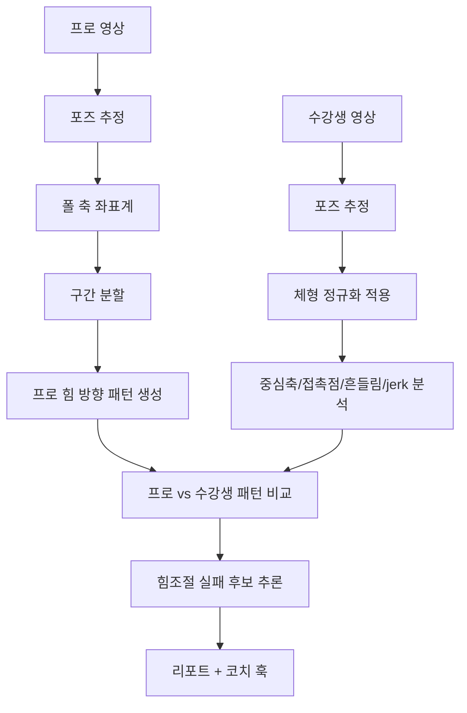

# 폴스포츠 AI 모션 분석 — 힘 방향·힘조절 패턴 엔진 (최종 / v1 개발 스펙)

> 대상: Claude Code / Codex / CLI 기반 개발 AI
> 목적: 프로(세계 챔피언) 모션과 수강생 모션 비교 시, 영상에서 보이는 중심축·접촉점·흔들림·속도변화·관절흐름으로 **힘의 방향 패턴과 힘조절 실패 패턴을 추론**하는 엔진을 설계한다. (힘의 *양*은 측정하지 않는다.)
> 짝 문서: **`01_체형차이_보정엔진_FINAL.md`** — 0장은 두 문서가 동일하다. 이 엔진은 그 문서의 `BodyNormalizationProfile`를 입력으로 소비한다.

---

## 0. 시스템 컨텍스트 (먼저 읽을 것 — 두 문서 공통)

### 0.1 전체 파이프라인

```
영상 입력 (userType: pro_reference | student)
  → [공통] 포즈·3D 추정 (MVP: MediaPipe / 고도화: NLF→SMPL-X)
  → [공통] 폴 축 검출 & 기준 좌표계 정렬
  → [공통] 동작 구간 분할 (entry / lock / transition / final_shape / hold)
  → [공통] 체형 세그먼트 추정 → BodyNormalizationProfile
  → ├── 엔진 A: 체형 차이 보정          ← 짝 문서
  │   └── 엔진 B: 힘 방향·힘조절 패턴    ← 이 문서 (BodyNormalizationProfile 소비)
  → 통합 비교 결과 (구조화된 findings)
  → [공통] LLM 설명 엔진 (Gemini): 판단이 아니라 자연어 번역만
  → [공통] 코치 마무리 훅: 구조화된 결과에 전문가 코멘트 부착
  → 리포트
```

### 0.2 세 가지 비교 기준 프레임

```ts
type ReferenceFrame =
  | 'judging_criteria'   // 절대·객관 (IPSF/POSA). 힘은 직접 채점 안 되나, 라인/위치로 간접 점검
  | 'champion_reference' // 열망 모범. 세계 챔피언의 '성공 힘 흐름'을 기준화
  | 'self_progress';     // 자기 성장. 본인 과거 영상 대비
```

### 0.3 두 가지 모드

```ts
type ComparisonMode = 'judging' | 'coaching';
```

- 힘 엔진은 **주로 코칭 모드**에서 작동한다(힘은 대회 점수로 직접 매겨지지 않음).
- 심사 모드에서는 힘 자체를 점수화하지 않되, "골반이 폴 축에서 이탈"처럼 *기하적으로 드러나는* 라인/위치 문제를 짝 엔진의 Code of Points 점검에 신호로 넘긴다.
- 모든 출력은 체형 정규화 결과와 **반드시 결합**해서 비교한다.

### 0.4 영상으로 잡히는 것 vs 안 잡히는 것 (= AI vs 코치 경계) — 이 엔진의 핵심

| 항목 | 영상 직접 측정 | 담당 |
|---|---|---|
| **움직임/궤적의 방향·순서·타이밍** | ✅ 가능 | **AI (이 엔진)** — "골반이 위로 가야 하는데 아래로 갔다" |
| 중심축 이탈·접촉점 안정성 | ✅ 가능 | AI (이 엔진) |
| 힘 조절 *품질* (흔들림·jerk·고정 실패) | ✅ 간접 | AI (이 엔진) |
| **근육이 당기는 힘의 *방향* (내부 힘)** | ❌ 불가 | 챔피언 EMG 레퍼런스(v2) + 코치 |
| 근육 사용량(%)·전완 힘(N)·근육량 | ❌ 불가 | 측정 금지 |
| 실패의 *원인* (근력 vs 기술 vs 접촉점 vs 유연성 vs 공포) | ❌ 불가 | **코치** |

> **결정적 구분**: "움직임의 방향"(=궤적/가속도 방향, 영상에서 측정 ✅) ≠ "근육 힘의 방향"(=내부 힘, 측정 ❌). 정적 홀드는 움직임이 없어도 근육은 힘을 쓰므로 이때 움직임-방향 신호는 거의 없다. 관찰되는 가속도는 *중력+그립 외력+근육 힘의 합(net)*이라, 근육이 어디로 당기는지는 그립 외력을 모르면 못 푼다.
> → **이 엔진은 "움직임 패턴 방향 + 힘조절 품질"을 측정**하고, "근육 힘의 방향/원인"은 **챔피언 EMG 레퍼런스 + 코치**가 채운다. "방향 피드백"이라 부르되, *내부 근육 힘을 측정했다고 주장하지 않는다.*

### 0.5 AI + 코치 = 완성 (포지셔닝)

- AI 80%(패턴 추출·1차 후보) + 코치 20%(원인 확정·언어 큐·검수).
- "AI 단독 코칭" 금지. 모든 결과에 `coachCommentHook`.
- 티어: ① AI 리포트 → ② AI + 코치 코멘트(프리미엄) → ③ AI + 세계 챔피언 코멘트(럭셔리).

### 0.6 v1 / v2 범위

- **v1 (이 스펙)**: 폴 축 좌표계 + 구간 분할 + 중심축/접촉점/흔들림/jerk 분석 + 프로 '힘 흐름' 기준 비교 + "가능성 높은 실패 원인 후보 3개" + 코치 훅. *힘은 측정 안 함, 패턴 추론만.*
- **v2**: **챔피언 EMG·접촉력·3D 모션캡처 레퍼런스 데이터셋**(아래 0.8) + push/pull/brace/rotate/release 자동 분류 학습 + 힘조절 실패 유형 자동 분류 + Gemini 큐 생성.
- **절대 약속 금지**: 영상만으로 근육량/근력/근육 사용량 단정, **온-폴 inverse dynamics 근력 측정**.

### 0.7 포즈 엔진 선택 & 리스크

- MVP: MediaPipe Pose / MoveNet (무료, 2D/2.5D). 고도화: **NLF**(NeurIPS 2024, SOTA 3D+체형, ⚠️ 공개 가중치 비상업 연구용 → 상업화 시 라이선스/자체학습) → SMPL-X.
- 상용 대안: Uplift Labs / Kemtai / Sency (폴 특화·기준은 직접 정의).
- ⚠️ **가림(occlusion)**: 봉을 감싸는 접촉으로 포즈 정확도 급락. 다중 시점·시간 스무딩·confidence 게이트·저신뢰 프레임 "추정" 표기 필수. *흔들림/jerk 신호는 특히 노이즈에 민감하니 스무딩·임계값 주의.*

### 0.8 챔피언 레퍼런스 = 해자 (왜 EMG가 더 중요해지는가)

온-폴 힘은 시뮬레이션(inverse dynamics)으로 못 푼다(그립 마찰 외력 미측정). 따라서 **"어디에 힘을 주는가"의 유일한 그라운드 트루스는 챔피언 몸에서 *직접 측정*하는 것**이다 — EMG(근육 활성) + 접촉력 센서 + 다각도 영상으로 동작당 1회 캡처해 레퍼런스 라이브러리를 구축한다. 이 독점 데이터셋은 경쟁사가 못 베끼는 핵심 자산이다(v2). v1은 *챔피언 영상*만으로 '성공 힘 흐름'(궤적/순서/접촉/안정) 기준을 만든다.

---

## 1. 핵심 결론

MVP에서 "힘"은 직접 측정하지 않는다. 영상만 보고 "광배 37%", "전완 120N 부족", "근육량 부족"을 단정하면 안 된다.

> **프로의 성공 동작에서 보이는 *힘의 방향 패턴*을 기준화하고, 수강생 영상에서 힘이 어디로 *새거나 고정되지 않는지*를 간접 추론한다.**

핵심은 **힘의 양 측정**이 아니라 **힘의 방향·전달·고정·이탈 패턴 분석**이다. (방향 = *움직임 패턴* 방향이며, 내부 근육 힘 방향은 챔피언 EMG+코치가 채운다 — 0.4 참조.)

---

## 2. 개발 목표

### 2.1 MVP
- 프로 영상에서 구간별 힘 방향 패턴 추론.
- 수강생 영상에서 중심축 이탈·접촉점 불안정·흔들림·jerk·고정 실패 분석.
- 체형 정규화 결과와 결합해 프로 vs 수강생 힘 사용 *방향* 차이 설명.
- "가능성 높은 실패 원인 후보"로 제시(단정 금지).
- 전문가 코멘트 옵션이 붙도록 구조화.

### 2.2 장기
- EMG·접촉력 센서·3D 모션캡처로 실제 힘/근육 활성 레퍼런스 데이터셋 구축(0.8).
- 동작별 push/pull/brace/rotate/release 패턴 학습.
- 힘조절 실패 유형 자동 분류.

---

## 3. 개발하지 말아야 할 것

| 금지/후순위 | 이유 |
|---|---|
| 영상만으로 근육 사용량 정량 단정 | EMG 없이는 위험 |
| "근력이 부족합니다" 단정 | 원인이 근력/타이밍/접촉점/유연성/공포 등 다양 |
| inverse dynamics를 MVP 핵심으로 | 폴 접촉력·마찰·그립 외력 모델 없이는 정확도 의미 약함 |
| 결과 자세만 비교 | 힘 흐름은 진입-고정-전환-유지 *타이밍*에서 드러남 |
| 점수 랭킹 | 부상 위험·비교 스트레스·잘못된 경쟁 유도 |
| "근육 힘 방향을 측정했다" 주장 | 측정은 움직임 방향까지. 내부 힘은 추론/레퍼런스/코치 |

---

## 4. 핵심 개념

### 4.1 힘의 방향 패턴

```ts
type ForceDirectionPattern =
  | 'pull'    // 당김: 손/광배/등으로 몸을 끌어올림
  | 'push'    // 밀어냄: 골반/다리/발등으로 폴을 밀거나 지지
  | 'brace'   // 고정: 코어/내전근/레그락으로 버팀
  | 'rotate'  // 회전: 몸통/골반/시선 방향 전환
  | 'release' // 이완/풀림: 접촉점·힘 고정이 풀림
  | 'unknown';
```

### 4.2 힘조절 실패 신호 (간접)

| 영상 신호 | 가능한 해석 |
|---|---|
| 중심축이 폴 바깥으로 이탈 | 코어/골반 고정 부족 가능성 |
| 골반이 아래로 떨어짐 | 상체로 버티는 보상 패턴 가능성 |
| 어깨가 귀 쪽으로 상승 | 광배/코어보다 승모·팔 의존 가능성 |
| 팔꿈치가 급격히 잠김 | 손·어깨로 과도하게 버티는 패턴 가능성 |
| 다리 접촉점이 늦게 고정 | 내전근/레그락 타이밍 부족 가능성 |
| 흔들림 증가 | 유지 근력·호흡·긴장 조절 문제 가능성 |
| jerk 값 증가 | 힘을 부드럽게 전달 못하는 패턴 가능성 |
| 폴과 골반 거리 증가 | 힘이 바깥으로 새는 패턴 가능성 |

> 전부 "가능성"이다. 원인 확정은 코치(0.4).

---

## 5. 입력값

### 5.1 프로 기준 패턴

```ts
type ProMotionReference = {
  referenceId: string;
  movementName: string;
  phases: MotionPhaseReference[];
  notesFromExpert?: string[];
  emgReference?: EmgReference[];   // v2: 챔피언 EMG 측정 데이터(0.8)
};

type MotionPhaseReference = {
  phase: 'entry' | 'lock' | 'transition' | 'final_shape' | 'hold';
  expectedContactPoints: ContactPoint[];
  expectedCenterAxisBehavior: string;
  expectedForcePatterns: ForceDirectionPattern[];
  keyJointFlow: string[];
};

type EmgReference = {              // v2
  phase: string;
  muscle: 'lat' | 'core' | 'forearm' | 'adductor' | 'shoulder' | string;
  activationTimingMs: number;
  relativeActivation: number;      // 정규화된 상대 활성
};
```

### 5.2 수강생 분석 입력

```ts
type StudentMotionAnalysisInput = {
  videoId: string;
  movementName: string;
  poseFrames: PoseFrame[];
  poleAxis: PoleAxis;
  bodyNormalizationProfile: BodyNormalizationProfile; // 짝 문서 산출물
  selfReportedLimitations?: string[];
  mode: ComparisonMode;
};
```

### 5.3 접촉점 후보

```ts
type ContactPoint =
  | 'left_hand' | 'right_hand'
  | 'left_inner_thigh' | 'right_inner_thigh'
  | 'left_knee' | 'right_knee'
  | 'left_foot' | 'right_foot'
  | 'left_ankle' | 'right_ankle'
  | 'hip' | 'unknown';
```

---

## 6. 분석 흐름



---

## 7. 핵심 계산값

### 7.1 중심축 이탈

```ts
type BodyLineTiltMetric = {
  phase: string;
  pelvisDistanceFromPoleAxis: number;
  chestDistanceFromPoleAxis: number;
  shoulderTilt: number;
  hipTilt: number;
  deviationDirection: 'up' | 'down' | 'left' | 'right' | 'outward' | 'inward' | 'unknown';
  severity: 'low' | 'medium' | 'high';
};
```

### 7.2 흔들림 / 안정성

```ts
type StabilityMetric = {
  phase: string;
  jitterScore: number;
  jerkScore: number;          // 움직임 부드러움(3차 미분). 가림/노이즈 스무딩 후 계산
  holdStabilityScore: number;
  unstableBodyParts: string[];
};
```

### 7.3 접촉점 안정성

```ts
type ContactStabilityMetric = {
  phase: string;
  contactPoint: ContactPoint;
  estimatedStable: boolean;
  lostContactAtMs?: number;
  confidence: number;
};
```

---

## 8. 힘 방향 패턴 추론 알고리즘 초안

```ts
function inferForceDirectionPattern(
  phaseFrames: PoseFrame[],
  poleAxis: PoleAxis,
  contactMetrics: ContactStabilityMetric[],
  axisMetrics: BodyLineTiltMetric[],
  stabilityMetrics: StabilityMetric[]
): ForcePatternInference {
  const findings: ForcePatternFinding[] = [];

  if (isPelvisDroppingOrMovingOutward(axisMetrics)) {
    findings.push({ pattern: 'release',
      reason: 'Pelvis moves downward/outward from pole axis',
      interpretation: '골반 고정이 풀리며 힘이 아래/바깥으로 새는 패턴 가능성',
      confidence: 0.72 });
  }
  if (isShoulderElevatedAndElbowLocked(phaseFrames)) {
    findings.push({ pattern: 'pull',
      reason: 'Shoulder elevation with elbow lock',
      interpretation: '광배/코어보다 손·어깨로 버티는 보상 패턴 가능성',
      confidence: 0.68 });
  }
  if (isLowerBodyContactDelayed(contactMetrics)) {
    findings.push({ pattern: 'brace',
      reason: 'Lower body contact stabilizes late',
      interpretation: '레그락/내전근 고정 타이밍 지연으로 상체 부담 가능성',
      confidence: 0.7 });
  }
  if (hasHighJerkOrJitter(stabilityMetrics)) {
    findings.push({ pattern: 'unknown',
      reason: 'High jerk/jitter during hold or transition',
      interpretation: '힘을 부드럽게 전달 못하거나 유지 근력 부족 가능성',
      confidence: 0.63 });
  }
  return summarizeForcePatternFindings(findings);
}
```

---

## 9. 프로 모션 비교 로직

### 9.1 원칙
프로 모션은 "정답 자세"가 아니라 **기준 힘 흐름**으로 사용한다. 비교 질문: 프로는 어느 구간에서 먼저 고정하는가 / 어느 접촉점 중심으로 버티는가 / 골반·흉곽·어깨축이 어떤 순서로 움직이는가 / 힘을 위로 끌어올리는가, 안으로 모으는가, 바깥으로 미는가 / 수강생은 같은 구간에서 힘이 어디로 새는가.

### 9.2 비교 결과 스키마

```ts
type ForceComparisonFinding = {
  phase: 'entry' | 'lock' | 'transition' | 'final_shape' | 'hold';
  proPattern: string;
  studentPattern: string;
  differenceType:
    | 'axis_deviation' | 'late_contact_lock' | 'upper_body_compensation'
    | 'pelvis_drop' | 'unstable_hold' | 'timing_mismatch' | 'uncertain';
  recommendation: string;
  confidence: number;
};
```

---

## 10. 리포트 문장 규칙

### 10.1 좋은 표현
- "프로 기준 패턴은 골반을 먼저 폴 축 안쪽으로 고정한 뒤 상체가 위로 당겨지는 흐름입니다."
- "현재 영상에서는 골반이 먼저 아래로 빠지고 이후 손·어깨로 버티는 흐름이 보여, 힘이 위로 전달되지 못하는 패턴으로 해석됩니다."
- "다리 라인보다 골반 고정과 코어 브레이싱 타이밍이 우선으로 보입니다."
- "상체 보상 패턴이 반복되므로 광배·코어·내전근을 함께 쓰는 훈련이 필요할 수 있습니다."
- "영상상 추정이므로 전문가 코멘트와 함께 확인하는 것을 권장합니다."

### 10.2 피해야 할 표현
- "광배 37% 부족" / "근력이 부족합니다" / "전완 힘이 약합니다" / "이 자세는 틀렸습니다" / "AI가 정확히 힘을 측정했습니다" / "부상 위험 확정적".

---

## 11. 코치 개입 포인트 (신규)

| 단계 | AI 자동 | 코치 마무리 |
|---|---|---|
| 패턴 추출 | 중심축/접촉점/흔들림/jerk → 실패 후보 3개 | 후보 중 *진짜 원인 확정* (근력 vs 타이밍 vs 공포…) |
| 힘 방향 | 움직임 방향·순서 비교 | 내부 *근육 힘 방향* 해석(+챔피언 EMG 레퍼런스) |
| 처방 | "이 패턴 가능성" 제시 | 가르칠 수 있는 *언어 큐로 번역* ("이 타이밍에 코어 잠가라") |
| 안전 | 부상 위험 *신호* 플래그 | 통증·이력 고려 *판정* ("계속/중단/수정") |
| 신뢰 | confidence·가림 표기 | 저신뢰 프레임 검수 |

> 코치 코멘트는 **루브릭·템플릿**으로 표준화(품질 일관성·확장성).

---

## 12. MVP 우선 개발 기능

| 우선순위 | 기능 | 설명 |
|---:|---|---|
| 1 | 폴 축 기준 좌표계 | 모든 힘 방향 해석의 기준 |
| 2 | 동작 구간 분할 | 진입/고정/전환/완성/유지 |
| 3 | 중심축 이탈 분석 | 힘이 위/아래/바깥/안쪽 어디로 새는지 추정 |
| 4 | 접촉점 후보 탐지 | 손·다리·무릎·발등과 폴 관계 |
| 5 | 흔들림·jerk 분석 | 힘조절 실패 간접 신호 (스무딩 필수) |
| 6 | 프로 힘 방향 패턴 생성 | 정답 모양이 아닌 성공 흐름으로 저장 |
| 7 | 수강생 비교 리포트 | 실패 원인 후보 3개 |
| 8 | 전문가 코멘트 옵션 | AI 단독 단정 회피·신뢰·고단가 |

---

## 13. R&D 고도화 방향 (챔피언 레퍼런스 = 해자)

| 목적 | 기술/장비 | 설명 |
|---|---|---|
| 3D 고정밀 모션 | Theia3D / Vicon / Qualisys | 프로·수강생 3D 관절 움직임 |
| 근육 활성 | Delsys / Noraxon EMG / Myontec·Athos(웨어) | 광배·코어·전완·내전근 활성 *타이밍* 측정 → 챔피언 정답 데이터 |
| 접촉력 | Tekscan / FlexiForce / 로드셀 커스텀 폴 | 손·다리·발등이 폴에 가하는 힘 |
| 생체역학 | OpenSim / AnyBody (오프-폴 컨디셔닝 한정) | 지면 접촉 동작의 관절 부하·위험. *온-폴 근력 추정엔 사용 금지* |
| 전문가 라벨링 | 강사/선수/운동역학 전문가 | 성공/실패 원인을 구조화 데이터로 축적 |

---

## 14. force feedback 예시

**예시 1 — 힘이 아래로 빠지는 패턴**
```md
프로 기준 패턴은 골반을 먼저 폴 축 안쪽으로 고정한 뒤 상체가 위로 당겨지는 흐름입니다.
현재 영상에서는 골반이 먼저 아래로 빠지고 이후 손·어깨로 버티는 흐름이 나타납니다.
단순히 다리를 더 높이기보다, 골반 고정과 코어 브레이싱을 먼저 만들고 광배로 끌어올리는 방향 전환이 필요해 보입니다.
```

**예시 2 — 바깥으로 새는 패턴**
```md
다리 라인은 기준과 크게 다르지 않지만, 골반이 폴 중심선에서 멀어지며 힘이 바깥으로 새는 패턴이 보입니다.
다리 각도를 올리기보다, 폴을 안쪽으로 끌어안는 내전근 사용과 흉곽 방향 조절이 우선입니다.
```

**예시 3 — 상체 보상 패턴**
```md
유지 구간에서 어깨 상승·팔꿈치 잠김이 반복됩니다. 손·어깨로 버티는 보상 패턴일 수 있습니다.
광배·코어·하체 접촉점을 함께 쓰는 연습이 필요해 보이며, 통증이 있다면 전문가 확인이 필요합니다.
```

---

## 15. 최종 개발 원칙

1. 힘은 직접 측정하지 않고 *방향 패턴*을 추론한다 (움직임 방향까지만 측정).
2. 모든 분석은 "가능성"으로 표현하고 단정하지 않는다.
3. 프로 모션은 정답 외형이 아니라 성공 힘 흐름 기준이다.
4. 체형 정규화 결과와 반드시 결합해 비교한다.
5. 중심축·접촉점·흔들림·jerk·타이밍을 핵심 신호로 쓴다 (가림 스무딩 필수).
6. LLM/Gemini는 판단 엔진이 아니라 설명 엔진이다 (좌표 출력 의존 금지).
7. 전문가 코멘트 구조를 남겨 신뢰도·고단가 상품성을 확보한다.
8. R&D에서 EMG·접촉력·3D 캡처로 *챔피언 정답 데이터셋*(해자)을 구축한다.
9. 온-폴 inverse dynamics 근력 측정은 약속하지 않는다.

---

## 16. 최종 한 줄 정의

> **힘 분석 엔진은 실제 힘을 정량 측정하는 기능이 아니라, 프로의 성공 힘 흐름과 수강생의 움직임 결과를 비교해 힘이 어디로 새거나 고정되지 않는지를 설명하고(움직임 방향까지 측정), 내부 근육 힘 방향과 원인은 챔피언 EMG 레퍼런스와 코치 마무리로 완성하는 패턴 추론 엔진이다.**
