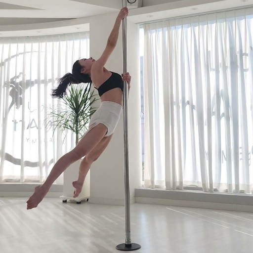
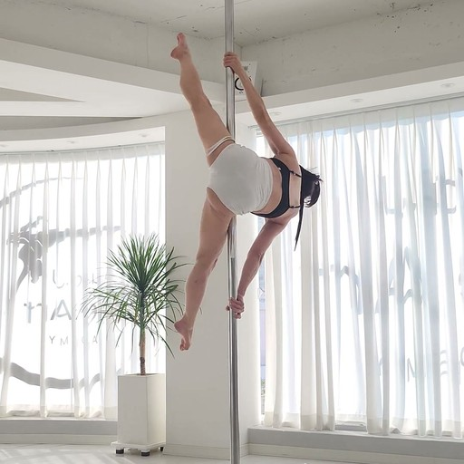

# 촬영과 등록 가이드 (공급자용)

> Phase 38 D-18 산출물(REQ-38-8). 기준 동작을 올리는 공급자(강사·선수)를 위한 쉬운 말 가이드다.
> 운영자 절차는 `reference-capture-guide.md` §6 에 그대로 있다 — 이 문서는 그것을 대신하지 않는다.
> 이 문서는 링크 페이지의 상세 가이드 화면(UI-SPEC A-6)과 **글자 단위로 같다**. 문장을 바꾸면
> `app/src/constants/supplierCopy.ts` 의 `guide.*` 도 같이 바꿔야 한다 — `supplierCopy.test.ts` 가
> 이 파일을 읽어 대조한다.
> 2026-09-30 quick-260930-w9l — belle 폰 확인 뒤 §2·§3·§5·§7 수정(5초~2분 · 1GB · 소리 서버 제거 ·
> 선언 3 삭제 · 선수 이름 고정 · 학습은 공급자 계약 · 필수 동의 2).

---

정은지 선수 기준 영상과 같은 조건으로 찍으면 돼요.

## 1. 어떻게 찍나요

- 폰을 세로로 세워요.
- 삼각대나 거치대에 고정해요. 손으로 들고 찍으면 흔들려서 관절을 잘못 읽어요.
- 카메라 높이는 허리와 가슴 사이예요. 폴이 화면에서 똑바로 서 있게 맞춰요.
- 폴 전체(천장부터 바닥까지)와 몸 전체가 동작 내내 화면 안에 있어야 해요. 보통 4~5m 떨어지면 돼요.
- 밝은 실내에서 찍어요. 창을 등지면 몸이 검게 나와서 못 읽어요.
- 화면에는 한 사람만 나와요. 뒤로 지나가는 사람도 없어야 해요.
- 시작 방향은 정해져 있지 않아요. 동작이 가장 잘 보이는 방향으로 찍되, 한 영상 안에서는 카메라를 움직이지 않아요.

이 정도 거리와 높이면 돼요 — 정은지 선수 기준 영상 프레임

## 2. 길이와 시작

- 길이는 5초~2분이에요. 동작 하나도, 여러 동작을 이은 콤보도 올릴 수 있어요.
- 폴 옆에 서서 1초쯤 있다가 시작해요. 서 있는 순간이 발 높이를 재는 기준이 돼요.
- 소리는 신경 쓰지 않아도 돼요. 등록할 때 영상의 소리를 지워서 저장해요.
- 영상 파일은 1GB까지 올릴 수 있어요.

## 3. 올릴 때 무엇을 적나요

- 동작 이름: 사전에 있는 동작을 고르거나 새 이름을 적어요. 이름은 등록 정보로 보관해요. 채점은 지금은 기본 비교 방식으로만 해요(동작별 규칙은 다음 단계).
- 레벨: 초급·중급·고급 중에서 골라요. 앱에서 이 레벨 탭에 보여요.
- 선수 이름: 초대할 때 확인한 실명으로 정해져 있어요. 바꾸려면 운영팀에 알려주세요.
- 서 있는 자세에서 시작했는지는 따로 묻지 않아요. 올린 영상에서 자동으로 확인하고, 서 있는 시작이 없으면 등록되지 않아요.

## 4. 올리면 무엇이 보이나요

- 올리면 관절을 자동으로 읽어서 기준 동작이 돼요. 몇 분 걸려요.
- 분석 서버가 꺼져 있으면 '대기 중'으로 있다가, 켜지면 이어서 처리돼요.
- 끝나면 '자기 영상 재분석 N점'이 보여요. 회원님 영상을 회원님 기준으로 다시 잰 점수예요. 100에 가까워야 정상이에요. 많이 낮으면 관절을 잘못 읽은 거라 다시 찍는 게 좋아요.
- 재현성 점수는 동작이 맞는지의 점수가 아니에요. 동작 정확도는 시험 영상으로 따로 봐요.

> **등록이 안 되는 4가지**
>
> · 사람을 찾지 못함 → 전신이 보이게, 더 밝게
>
> · 여러 사람이 나옴 → 한 사람만 나오게
>
> · 서 있는 시작이 없음 → 폴 옆에 서서 1초 뒤에 시작. 검사는 발 높이로만 보니 서 있는 자세인지는 사람이 확인해 주세요
>
> · 일부 관절을 못 읽음 → 밝은 곳에서, 옷과 배경이 구분되게, 폴 전체와 전신이 들어오는 거리에서

## 5. 권리와 동의

- 영상은 회원님 것이에요. Sunity는 분석 기준으로 쓰고, 앱에서 보여주고, 사진(프레임)과 썸네일을 만드는 것만 허락받아요.
- 이름과 얼굴이 앱에 보여요(초상·성명 사용).
- AI 학습: 공급자 계약에 따라 올린 영상을 Sunity AI 학습에도 써요. 학습용 영상과 데이터는 외부에 공개하거나 넘기지 않아요.
- 철회: 동의는 언제든 철회할 수 있어요. 운영팀에 알려주면 그 영상은 새 분석의 기준으로 더 쓰이지 않고 앱에서 재생되지 않아요. 이미 끝난 수강생의 분석 기록(각도·동작 이름)은 수강생의 기록이라 남아요.
- 필수 항목(초상·성명 사용, 영상 이용)에 동의하지 않으면 등록할 수 없어요.

## 6. 내 코드를 수강생에게 알려주는 법

- 페이지의 '내 코드'를 수업 때 불러 주세요.
- 수강생은 앱 마이 탭 '강사 코드' 칸에 넣어요. 그러면 회원님 수강생으로 연결돼요. (입력 칸은 다음 업데이트에서 열려요)

## 7. 자주 틀리는 것

- 너무 가까이(약 3m 안쪽)에서 찍기 → 폴 전체가 안 들어와요.
- 손으로 들고 찍기 → 흔들려서 관절을 잘못 읽어요.
- 뒤에 다른 사람 → 여러 사람으로 잡혀요.
- 창을 등지고 찍기(역광) → 몸이 검게 나와요.
